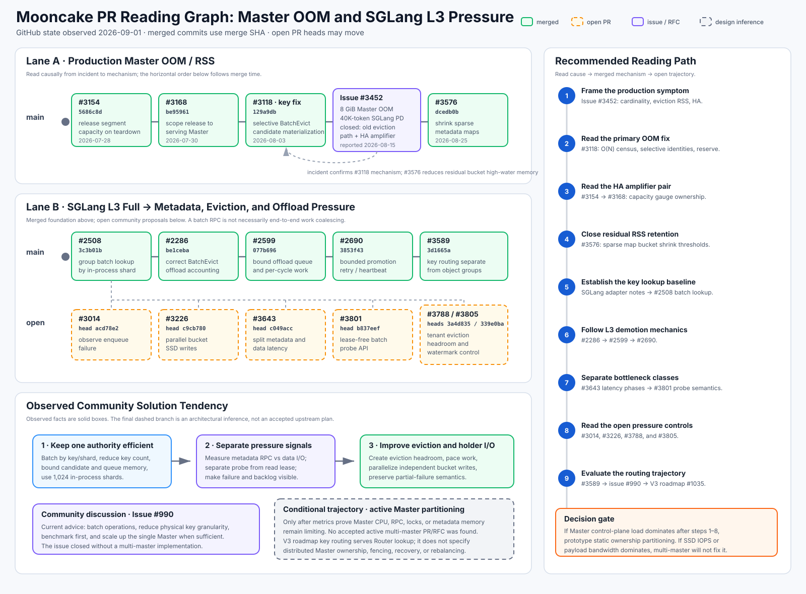

# PR Reading Plan: Master OOM and SGLang L3 Saturation

> - Planning date: 2026-09-01
> - Workspace baseline: Git `HEAD` at `a3e2f9ae`
> - Scope: Mooncake Store Master memory behavior and SGLang HiCache behavior
>   when the Mooncake DRAM tier is full
> - Status: investigation plan; suspected failure modes and proposed solutions
>   are not conclusions



The diagram is also available as a [standalone SVG](gitimage.svg). 
Its links open the corresponding GitHub PRs and issues.

## GitHub Evidence Checkpoint

The GitHub review changes the priority of the two workstreams:

- The production OOM report in
  [issue #3452](https://github.com/kvcache-ai/Mooncake/issues/3452) is closed.
  The reported `v0.3.12.post1` path materialized a full eviction candidate,
  including copied key and tenant strings, for every eligible object. 
  Merged [PR #3118](https://github.com/kvcache-ai/Mooncake/pull/3118) selectively
  materializes candidates after a lightweight timestamp census. 
  Merged [PR #3154](https://github.com/kvcache-ai/Mooncake/pull/3154) and its correction
  [PR #3168](https://github.com/kvcache-ai/Mooncake/pull/3168) fix an HA capacity-accounting amplifier. 
  Merged [PR #3576](https://github.com/kvcache-ai/Mooncake/pull/3576) additionally
  shrinks sparse metadata-map bucket arrays after eviction.
- The L3-saturation work remains distributed among smaller mechanisms. 
  Merged PRs group batch lookup by an in-process shard, correct offload eviction accounting, 
  bound offload scheduling, and retry promotion work. 
  Open PRs add lease-free probes, metadata/data latency separation, enqueue-failure
  observability, parallel bucket writes, and tenant eviction headroom.
- The available community discussion does not establish active multi-master as the current implementation direction. 
  In [issue #990](https://github.com/kvcache-ai/Mooncake/issues/990), the immediate direction is batching, 
  fewer physical keys, benchmarking, in-process shards, and scaling up the serving Master. 
  The [V3 roadmap](https://github.com/kvcache-ai/Mooncake/issues/1035) includes key-based routing for a Router lookup service, 
  but it does not define partitioned Master ownership, per-partition fencing and recovery, or online rebalancing. 
  Active multi-master therefore remains a conditional design branch rather than an observed upstream commitment.

This checkpoint is a GitHub state snapshot from 2026-09-01. 
Open PR heads and review outcomes require revalidation when the full report is executed.

## Baseline and Terminology

The existing notes establish the following source-level baseline:

- SGLang derives stable KV-page keys and expands each logical page into one or more Mooncake object keys. 
  Mooncake maps each exact key to object and replica metadata.
- The Master handles metadata lookup, placement, leases, eviction, and offload task state. 
  It does not carry the KV payload in the normal `MEMORY` transfer path.
- In the terminology used by these notes, L3 is Mooncake distributed DRAM and L4 is SSD or another colder tier. 
  These are deployment-level names, not Store API types.
- The current Master divides metadata among 1,024 in-process shards. 
  This reduces lock contention but does not distribute metadata ownership or memory across multiple serving Master processes.
- HA leader/standby support selects one serving authority. 
  It is distinct from the active, partitioned multi-master design considered in this plan.

The relevant existing introductions are
[the SGLang L1-L4 tutorial](../user-notes.md),
[the source-reading guide](../guide/source-reading-guide.md), and
[the recent Master integration review](recent-mooncake-master-main-review-2026-08-31.md).

The investigation has two workstreams.

## 1. Potential OOM While the Master Is Running

### 1.1 Question and boundaries

Determine whether a long-running serving Master can exceed its memory budget,
and classify any observed growth as one of the following mechanisms:

1. expected retained state proportional to live object, replica, tenant, or group cardinality;
2. bounded but excessive backlog in replication, offload, promotion, client task, event, or OpLog state;
3. transient amplification during snapshot, restore, serialization, or large batch RPC processing;
4. allocator fragmentation or delayed release after logical deletion; or a lifecycle defect that leaves unreachable state retained.

The first pass must separate Master RSS from the capacity of mounted client segments. 
A mounted `MEMORY` replica records remote allocation metadata in the Master; 
its payload remains in the holder process.

### 1.2 PR reading sequence

Use the current upstream graph at the time of the review. 
The following local commits provide the initial PR set; 
adjacent prerequisite and follow-up PRs must be added when their diffs change ownership or cleanup behavior.

| Reading group | Initial PRs | Question for each diff |
|---|---|---|
| Metadata shape and lookup | #2232 tenant metadata isolation, #2508 shard-grouped `BatchGetReplicaList`, #2685 read-only batch query, #3071 quota extraction | What is retained per key, tenant, group, and replica, and which paths erase it? |
| Background state | #2599 offload queue limits, #2690 promotion retry, #3422 `BatchEvict` failure handling | Are queue entries, pins, retry candidates, and finished tasks bounded and removed on every terminal path? |
| Snapshot and recovery | #2805, #2831, #2879, #3640, and #3642 | Does a snapshot or restore duplicate the full metadata image, fork with copy-on-write exposure, or build large temporary buffers? |
| Events and resource ownership | #2214 KV events and the SegmentPool series beginning with #3703 | Can subscribers, publication queues, prepared resources, or replacement state retain per-key or per-region objects? |

For every selected PR, record:

- the owning container or object before and after the change;
- cardinality and byte-size drivers;
- insertion, success cleanup, error cleanup, timeout cleanup, and shutdown
  cleanup paths;
- configured and hard bounds;
- full-image copies or serialization buffers;
- labels whose cardinality grows with keys, clients, tenants, or segments; and
- tests and metrics that can distinguish retained live state from leaked state.

PR descriptions are discovery aids. Conclusions must follow the merged diff,
its tests, and the resulting call graph.

### 1.3 Source and runtime audit

Trace these owners from `MasterService` and its adjacent execution boundaries:

```text
Object key
  -> MetadataShard::TenantState::metadata
  -> ObjectMetadata and Replica descriptors
  -> lease, group, processing, replication, offload, and promotion state
  -> task manager, OpLog, event publication, and snapshot state
```

The static audit will produce a retention table with columns for owner,
element type, growth key, upper bound, insertion path, removal path, and observability. 
It must include `processing_keys`, `replication_tasks`, `offloading_tasks`, `promotion_tasks`, `promotion_candidates`, 
group indexes, discarded replicas, client task history, snapshot buffers, and OpLog writer queues.

The runtime audit will use four isolated workload shapes:

1. increasing unique-key cardinality with stable total payload bytes;
2. stable live-key cardinality with repeated insert, evict, and delete cycles;
3. forced offload or promotion backlog with a slow or unavailable holder;
4. snapshot and HA recovery under concurrent metadata mutation.

Collect Master RSS/PSS, allocator active and retained bytes when available, container cardinalities, 
queue depth, task-state counts, object and replica counts, snapshot child/parent peaks, and post-quiescence memory. 
Report both bytes per live key and residual bytes per completed lifecycle.

### 1.4 Expected output and decision criteria

The workstream output is an evidence table of OOM mechanisms ranked by peak memory, 
growth rate, reachability, and operational likelihood. 
Each finding must identify the first introducing PR or the PR that materially changed its bound.

A proposed fix is ready for design only when the reproduction distinguishes
capacity from leakage and supplies one of these acceptance criteria:

- a hard memory or cardinality bound with explicit admission failure;
- stable post-quiescence memory for repeated lifecycle tests;
- bounded snapshot peak relative to live metadata size; or
- horizontal partitioning with a measurable reduction in memory per serving Master.

## 2. SGLang Backend Under L3 Saturation and Batch Offload Pressure

### 2.1 Question and boundaries

Determine what work is amplified when SGLang fills the L3 DRAM tier and
Mooncake initiates a large offload or eviction cycle. The term **key I/O** must
be decomposed before evaluating solutions:

| Load dimension | Examples | Candidate bottleneck |
|---|---|---|
| Key generation and expansion | logical SGLang pages expanded into physical K/V or layer keys | SGLang CPU and Python/native boundary |
| Control-plane key operations | `BatchExistKey`, `BatchGetReplicaList`, lease updates, offload task publication, completion notification | Master RPC, CPU, locks, and metadata memory |
| SSD operations | file-index lookup and small or scattered object writes/reads | holder CPU, filesystem, NVMe queue depth, and write amplification |
| Payload transfer | L3 memory to holder staging and later L4 to requester L2 | Transfer Engine, network, staging memory, and bandwidth |

An active multi-master design can reduce the first Master process's share of control-plane operations and metadata. 
It does not by itself reduce the number of SSD bytes, file operations, or network transfers. 
The review must therefore locate the saturated resource before recommending multi-master.

### 2.2 End-to-end path and PR reading sequence

Read the SGLang adapter and Mooncake changes as one path:

```text
SGLang logical pages
  -> physical Mooncake keys
  -> batch existence or replica query
  -> L3 capacity watermark and eviction selection
  -> per-key offload task and source pin
  -> holder heartbeat receives a task batch
  -> holder BatchOffload writes L4 data
  -> per-key success or failure updates Master metadata
  -> MEMORY replica becomes evictable
```

The initial PR sequence is:

1. #1834 and the current SGLang Mooncake adapter for batch-query reuse and
   physical-key expansion.
2. #2508 and #2405 for batch lookup grouping and eviction lookup contention.
3. #2286 for eviction accounting when SSD offload is enabled.
4. #2599 for offload queue and per-cycle caps.
5. #1319 for partial-success behavior in `BatchOffload`.
6. #2077, #2676, and #2690 for offload recovery, deletion, and promotion retry
   lifecycle.

For each PR, measure the unit of batching at every interface. 
A vector RPC that still performs one allocation, map mutation, log record, file lookup, 
or completion RPC per key is transport batching rather than end-to-end work coalescing.

### 2.3 Workload matrix

Reproduce L3 saturation with the following independent variables:

- logical page size and physical keys per logical page;
- average object size and total live-key cardinality;
- batch size and number of concurrent SGLang workers;
- overwrite ratio and cross-worker prefix reuse;
- L3 high and low watermarks;
- offload queue limit, per-cycle cap, and heartbeat batch size;
- holder count, SSD backend, file layout, and SSD latency; and
- promotion-on-hit enabled or disabled.

Collect batch RPC rate, keys per RPC, Master CPU and lock wait, scan work per evicted key, 
queue age and depth, pinned L3 bytes, offload success latency, 
per-key metadata mutations, OpLog/event volume, holder IOPS and throughput,
staging-buffer memory, network bytes, and SGLang cache-hit and recomputation rates.

The primary experiment must hold payload throughput constant while varying key size and key count. 
This separates a per-key control-plane limit from a byte-oriented storage or network limit.

### 2.4 Solution trajectory

Evaluate solutions in dependency order.

1. **Bound and observe the existing single Master.** 
   Add missing queue-age, keys-per-batch, scan-amplification, per-state cardinality, and overload metrics. 
   Define admission and backpressure behavior before queues consume the Master memory budget.
2. **Coalesce work without changing ownership.** 
   Preserve SGLang batches through shard lookup, eviction selection, task dispatch, completion, and
   OpLog/event publication. 
   Evaluate group or extent-level offload only if it reduces operations 
   while preserving per-object visibility and partial failure semantics.
3. **Reduce L3 saturation bursts.** 
   Use predictive watermarks, paced offload, byte-based rather than only key-based budgets, 
   holder-aware scheduling, and hot/cold admission 
   so that filling L3 does not create a synchronized full-tier scan and offload wave.
4. **Optimize the holder and L4 layout.** 
   If SSD IOPS is the limit, aggregate small objects into aligned extents or logs with an index, 
   issue larger asynchronous I/O, and separate foreground restore from background offload QoS. 
   Multi-master is not the remedy for this bottleneck.
5. **Partition the active Master control plane.** 
   If Master CPU, metadata memory, RPC throughput, or shard locks remain limiting, 
   route a stable `tenant + model namespace + object/group key` partition to independent serving Master shards. 
   Each shard owns its metadata, leases, offload state, OpLog, snapshot, and HA pair. 
   Clients split batches by routing shard and merge results.
6. **Add online rebalancing only after static partitioning is correct.** 
   Use versioned routing, ownership epochs, fencing, snapshot plus log handoff, and idempotent retries. 
   Avoid cross-shard object groups or define an explicit transaction protocol for them.

The multi-master design review must distinguish three structures:

```text
1,024 in-process MetadataShards
    reduce lock scope inside one Master

HA leader plus standby candidates
    preserves one serving authority and recovery path

active Master shards plus router
    partition metadata ownership and request load across processes
```

### 2.5 Multi-master acceptance gate

Advance from batching and backpressure to active Master partitioning only if the measurements show a control-plane limit 
and a static partition prototype demonstrates all of the following:

- near-linear reduction of metadata memory and key-operation load per Master;
- stable routing for all physical keys derived from one required atomic group;
- no duplicate serving authority during failover or rebalance;
- per-shard snapshot and OpLog recovery with explicit ownership epochs;
- bounded retry behavior for stale routing and partial batch failure;
- no regression in offload completion, lease safety, or eviction accounting;
- end-to-end improvement in SGLang hit latency or throughput, rather than only lower Master CPU usage.

The final report will state separately whether the dominant limit is Master memory, 
Master key-operation throughput, eviction/offload scheduling, holder SSD IOPS, 
staging memory, network bandwidth, or an interaction among them.

## Execution Order and Deliverables

The two workstreams share one evidence set and should be executed in this order:

1. freeze the upstream PR and source baseline;
2. construct the per-key memory and per-key I/O ownership tables;
3. read the initial PR sets and expand them through prerequisites and follow-ups;
4. run the cardinality and L3-saturation workload matrices;
5. attribute each observed knee or residual growth to a call path and PR; and
6. produce one findings report with separate observed facts, 
   derived conclusions, proposals, and validation results.

The report is complete when it includes a reproducible OOM or a measured safe
bound, a quantified L3-saturation bottleneck, and a solution recommendation
that explains whether multi-master changes the limiting resource.
