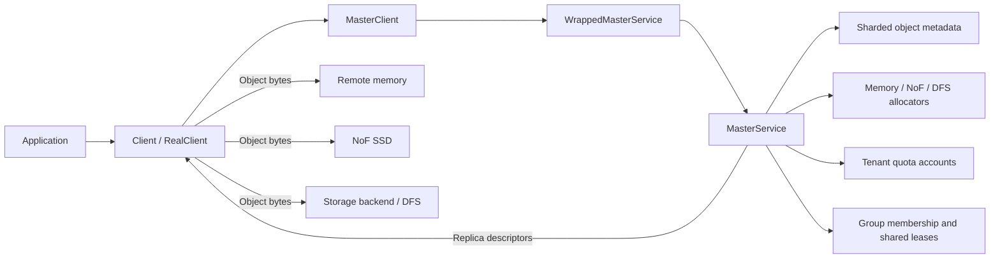
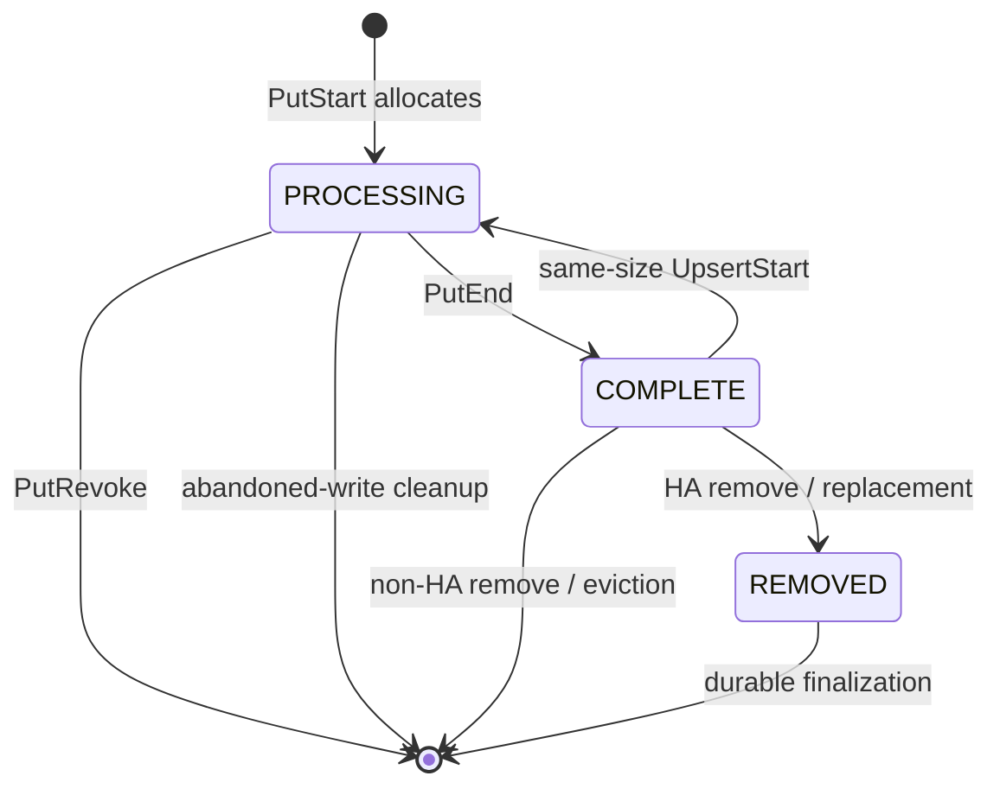

# Core architecture

## Control plane and data plane

Mooncake Store separates metadata coordination from object-byte movement.
The Master Service is the control plane: it validates requests, allocates replicas, records lifecycle state, enforces memory quota, and returns replica descriptors. 
The client is the data-plane coordinator: it moves bytes directly to the allocated memory, NoF, disk, or DFS destinations and reports the result to the Master.



The Master does not relay the object payload. 
This separation keeps large data transfers off the metadata RPC path and makes the `Start` and `End` operations coordination boundaries rather than data-copy operations.

## Request layers

| Layer | Main responsibility | Representative type |
|---|---|---|
| Public client | Checksums, slice preparation, transfer scheduling, finalize decision | `Client` / `RealClient` |
| Master RPC client | Serializes tenant-scoped requests and returns typed results | `MasterClient` |
| RPC boundary | Tenant syntax and mode validation, batch shape validation | `WrappedMasterService` |
| Master core | Allocation, metadata mutation, quota, leases, tasks, HA logging | `MasterService` |
| Data transport | Writes or reads bytes using returned descriptors | Transfer Engine, storage backend, DFS client |

## Metadata hierarchy

The primary identity is `(tenant_id, user_key)`. 
Objects are routed to one of 1,024 metadata shards by hashing that identity. 
A group identifier does not participate in object routing.

```text
MasterService
├── metadata_shards_[1024]
│   └── MetadataShard
│       ├── SharedMutex
│       └── tenants[TenantId] -> TenantState
│           ├── quota_account -> process-wide TenantQuotaAccount
│           ├── metadata[user_key] -> ObjectMetadata
│           ├── processing_keys
│           ├── replication_tasks
│           ├── offloading_tasks
│           ├── promotion_tasks / promotion_candidates
│           └── dynamic-replication state
└── group_domain_
    ├── SharedMutex
    └── groups[scoped(tenant_id, group_id)] -> GroupState
        ├── member_keys
        └── shared Lease
```

### Principal structures

`ObjectIdentity`
: Carries the stable namespace pair `TenantId tenant_id` and
  `std::string user_key`.

`TenantState`
: Holds the portion of one tenant's metadata and tasks that belongs to a
  particular metadata shard. The same tenant can therefore have one
  `TenantState` in many shards. Each state binds to the same process-wide
  quota account for that tenant.

`ObjectMetadata`
: Stores writer ownership, `put_start_time`, immutable object size, optional
  checksum, data type, immutable group identifier, tenant and user key, lease,
  hard/soft pin state, the quota ledger, and the replica vector.

`Replica::Descriptor`
: Is the client-facing description of an allocation. Its variant identifies a
  MEMORY, NoF, DISK, LOCAL_DISK, or DFS destination and carries the address or
  backend location required by the data plane.

`ReplicateConfig`
: Requests replica counts and placement preferences and carries hard/soft pin,
  data type, host, and optional per-key group identifiers.

`GroupState`
: Contains member keys and one shared lease. It is an auxiliary lifecycle
  index, not an object and not a metadata-routing unit.

## Replica lifecycle

Normal allocation creates replicas in `PROCESSING`. Successful finalization
changes selected replicas to `COMPLETE`; revocation removes failed processing
replicas. Removal and HA flows can use `REMOVED` as an intermediate state.



The `INITIALIZED` enum value exists, but the normal allocation paths described
here construct allocated replicas directly as `PROCESSING`.

## Concurrency boundaries

Mooncake uses shared locks for concurrent readers and exclusive locks for mutation. 
A shared lock can coexist with other shared locks. 
An exclusive lock waits until all shared and exclusive holders leave and then prevents any other holder from entering.

| Boundary | Shared-lock use | Exclusive-lock use |
|---|---|---|
| `snapshot_mutex_` | Ordinary operations that must not overlap an exclusive snapshot transition | Snapshot/restore or other whole-service transitions |
| Metadata shard mutex | Read-only lookup through RO accessors | Insert, state transition, task mutation, removal, and cleanup through RW accessors |
| `group_domain_` mutex | Copying group membership for inspection | Registering or unregistering members and rebuilding group state |
| Object-operation stripe | Not used in shared mode | Serializing conflicting start operations for one scoped object key |

Lock scope matters more than the lock label alone. The normal `PutStart` path
takes a shared snapshot lock and an exclusive lock for only the target metadata
shard. Group eviction may visit several shards, so it copies membership first
and then acquires shard locks in ascending shard order. It re-looks up and
revalidates each member under that member's shard lock.

### Ordinary `batch_get_into_multi_buffers` timeline

This timeline uses
`RealClient::batch_get_into_multi_buffers_internal()` as its baseline. It
describes a valid, nonempty batch whose keys resolve to readable `COMPLETE`
MEMORY replicas, whose destination buffers are large enough, and whose
`prefer_alloc_in_same_node` argument is `false`. Error branches and the
LOCAL_DISK, DISK, DFS, and NoF data paths diverge after replica selection.

#### Observed call chain

```text
RealClient::batch_get_into_multi_buffers_internal
  ├─ Client::BatchQuery(keys)
  │    └─ MasterClient::BatchGetReplicaList(keys, tenant_id)
  │         └─ RPC: WrappedMasterService::BatchGetReplicaList
  │              └─ MasterService::BatchGetReplicaList
  │                   ├─ group keys by metadata shard
  │                   ├─ acquire snapshot_mutex_ in shared mode
  │                   ├─ acquire the current MetadataShard mutex in shared mode
  │                   ├─ find ObjectMetadata for each key in that shard
  │                   ├─ copy readable Replica::Descriptor values
  │                   ├─ grant each object a read lease
  │                   ├─ release the current MetadataShard mutex
  │                   ├─ run eligible post-read accounting or queue hooks
  │                   └─ release snapshot_mutex_
  ├─ SelectBestReplica for each returned QueryResult
  ├─ create destination Slice values from all_buffers and all_sizes
  ├─ FilterQueryResult to retain only the selected replica
  └─ Client::BatchGet
       ├─ FindFirstCompleteReplica
       ├─ optionally RedirectToHotCache
       ├─ TransferSubmitter::submit one asynchronous read per key
       │    └─ submitMemoryReadOperation
       │         ├─ local source: enqueue a LOCAL_MEMCPY task
       │         └─ remote source: submit TransferRequest values to
       │            TransferEngine and the selected transport
       ├─ TransferFuture::get for each submitted operation
       ├─ verify checksums and lease expiration
       └─ return one expected result per key
```

The Master-side shared shard lock is first requested by construction of `MetadataShardAccessorRO` in `MasterService::BatchGetReplicaList`. 
Its constructor creates a `SharedMutexLocker` with `shared_lock`, which calls `lock_shared()` on `metadata_shards_[shard_idx].mutex`. 
Replica selection does not run under this lock: the Master copies descriptors into the RPC response, releases its locks, and the client subsequently calls `SelectBestReplica`.

`FilterQueryResult` constructs a `QueryResult` containing only the selected descriptor. 
Consequently, `Client::BatchGet` does not implement a second replica-selection or transfer-fallback pass. 
A transfer failure is reported for that key instead of retrying another descriptor from the original Master response.

#### Lock-state timeline

`S` denotes a shared lock held by this request, `W(S)` denotes that this request
is waiting to acquire a shared lock, and `-` denotes that this request does not
hold the lock. The shard column refers only to the one occupied metadata shard
being processed in the current loop iteration.

| Phase | Execution location and event | `snapshot_mutex_` | Current shard mutex | Object bytes moving |
|---|---|---:|---:|---:|
| 1 | RealClient validates inputs and calls `Client::BatchQuery` | `-` | `-` | No |
| 2 | MasterClient and WrappedMasterService dispatch `BatchGetReplicaList` | `-` | `-` | No |
| 3 | MasterService groups keys by shard and selects the first occupied shard to visit | `-` | `-` | No |
| 4 | MasterService constructs `shared_lock(snapshot_mutex_)` | `W(S)` then `S` | `-` | No |
| 5 | MasterService constructs `MetadataShardAccessorRO` | `S` | `W(S)` then `S` | No |
| 6 | MasterService looks up metadata, copies readable descriptors, and grants read leases for keys in that shard | `S` | `S` | No |
| 7 | `MetadataShardAccessorRO` leaves its inner scope | `S` | `-` | No |
| 8 | For the MEMORY baseline, optional dynamic-replication accounting runs; promotion-on-hit is ineligible; the per-shard loop iteration then ends | `S` then `-` | `-` | No |
| 9 | The RPC response returns and RealClient selects one replica, validates capacity, and builds destination slices | `-` | `-` | No |
| 10 | `Client::BatchGet` submits a local-copy or Transfer Engine operation for each key | `-` | `-` | Starts asynchronously |
| 11 | Submission continues for later keys while earlier operations may already be active | `-` | `-` | Yes |
| 12 | `TransferFuture::get` waits for completion; checksum and lease checks follow | `-` | `-` | Yes, until completion |
| 13 | Results return through RealClient; successful values report transferred byte counts | `-` | `-` | No |

For a batch spanning several shards, phases 4 through 8 repeat once for each
occupied shard. The implementation holds at most one metadata shard lock at a
time. Shared readers of that shard may proceed concurrently; an exclusive
metadata mutation on the same shard must wait. Neither the snapshot lock nor a
metadata shard lock is held during replica selection, transfer submission,
RDMA/TCP/local-copy execution, checksum verification, or result conversion.
If a non-MEMORY path is eligible for promotion-on-hit, its post-read hook may
acquire a fresh exclusive metadata accessor after the read-only accessor has
released the shard lock; that branch is outside the MEMORY baseline above.

The outer `RealClient::batch_get_into_multi_buffers()` wrapper starts its
operation timer before entering this baseline and observes the result after the
baseline returns. Its latency therefore includes the metadata RPC, lock waits,
replica and slice preparation, transfer submission, transfer completion, and
internal validation. `Client::BatchGet` also records a narrower timer beginning
immediately before transfer preparation and ending after completion and lease
checks; that timer excludes `Client::BatchQuery` and all Master-side lock waits.

## Architectural invariants

- Namespace isolation and routing use `(tenant_id, user_key)`.
- The Master returns locations; clients move object bytes.
- Readers see only eligible completed replicas.
- A primary write belongs to the client that started it.
- Memory quota is charged before exposing new allocation descriptors.
- A group shares lifecycle lease state but does not own replicas or quota.
- Batch APIs preserve per-key results; they do not create a multi-key atomic
  transaction.
