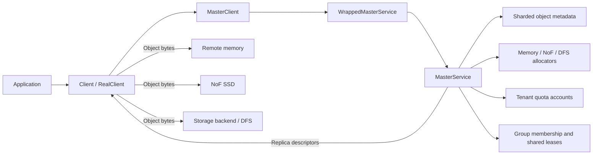
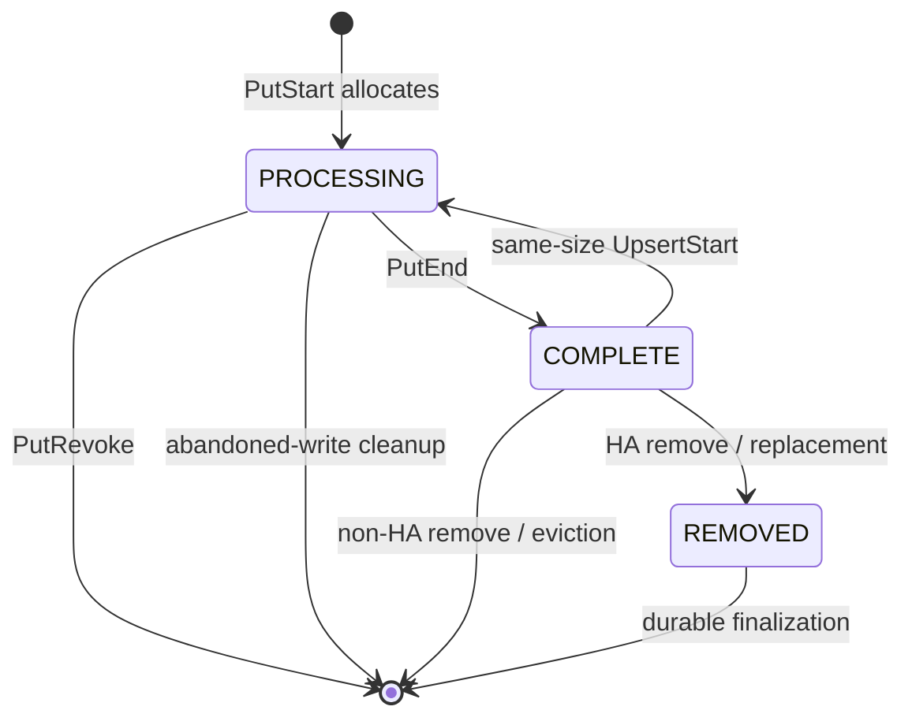

# Core architecture

## Control plane and data plane

Mooncake Store separates metadata coordination from object-byte movement.
The Master Service is the control plane: it validates requests, allocates
replicas, records lifecycle state, enforces memory quota, and returns replica
descriptors. The client is the data-plane coordinator: it moves bytes directly
to the allocated memory, NoF, disk, or DFS destinations and reports the result
to the Master.



The Master does not relay the object payload. This separation keeps large data
transfers off the metadata RPC path and makes the `Start` and `End` operations
coordination boundaries rather than data-copy operations.

## Request layers

| Layer | Main responsibility | Representative type |
|---|---|---|
| Public client | Checksums, slice preparation, transfer scheduling, finalize decision | `Client` / `RealClient` |
| Master RPC client | Serializes tenant-scoped requests and returns typed results | `MasterClient` |
| RPC boundary | Tenant syntax and mode validation, batch shape validation | `WrappedMasterService` |
| Master core | Allocation, metadata mutation, quota, leases, tasks, HA logging | `MasterService` |
| Data transport | Writes or reads bytes using returned descriptors | Transfer Engine, storage backend, DFS client |

## Metadata hierarchy

The primary identity is `(tenant_id, user_key)`. Objects are routed to one of
1,024 metadata shards by hashing that identity. A group identifier does not
participate in object routing.

```text
MasterService
├── metadata_shards_[1024]
│   └── MetadataShard
│       ├── SharedMutex
│       └── tenants[TenantId] -> TenantState
│           ├── quota_account -> process-wide TenantQuotaAccount
│           ├── metadata[user_key] -> ObjectMetadata
│           ├── processing_keys
│           ├── replication_tasks
│           ├── offloading_tasks
│           ├── promotion_tasks / promotion_candidates
│           └── dynamic-replication state
└── group_domain_
    ├── SharedMutex
    └── groups[scoped(tenant_id, group_id)] -> GroupState
        ├── member_keys
        └── shared Lease
```

### Principal structures

`ObjectIdentity`
: Carries the stable namespace pair `TenantId tenant_id` and
  `std::string user_key`.

`TenantState`
: Holds the portion of one tenant's metadata and tasks that belongs to a
  particular metadata shard. The same tenant can therefore have one
  `TenantState` in many shards. Each state binds to the same process-wide
  quota account for that tenant.

`ObjectMetadata`
: Stores writer ownership, `put_start_time`, immutable object size, optional
  checksum, data type, immutable group identifier, tenant and user key, lease,
  hard/soft pin state, the quota ledger, and the replica vector.

`Replica::Descriptor`
: Is the client-facing description of an allocation. Its variant identifies a
  MEMORY, NoF, DISK, LOCAL_DISK, or DFS destination and carries the address or
  backend location required by the data plane.

`ReplicateConfig`
: Requests replica counts and placement preferences and carries hard/soft pin,
  data type, host, and optional per-key group identifiers.

`GroupState`
: Contains member keys and one shared lease. It is an auxiliary lifecycle
  index, not an object and not a metadata-routing unit.

## Replica lifecycle

Normal allocation creates replicas in `PROCESSING`. Successful finalization
changes selected replicas to `COMPLETE`; revocation removes failed processing
replicas. Removal and HA flows can use `REMOVED` as an intermediate state.



The `INITIALIZED` enum value exists, but the normal allocation paths described
here construct allocated replicas directly as `PROCESSING`.

## Concurrency boundaries

Mooncake uses shared locks for concurrent readers and exclusive locks for
mutation. A shared lock can coexist with other shared locks. An exclusive lock
waits until all shared and exclusive holders leave and then prevents any other
holder from entering.

| Boundary | Shared-lock use | Exclusive-lock use |
|---|---|---|
| `snapshot_mutex_` | Ordinary operations that must not overlap an exclusive snapshot transition | Snapshot/restore or other whole-service transitions |
| Metadata shard mutex | Read-only lookup through RO accessors | Insert, state transition, task mutation, removal, and cleanup through RW accessors |
| `group_domain_` mutex | Copying group membership for inspection | Registering or unregistering members and rebuilding group state |
| Object-operation stripe | Not used in shared mode | Serializing conflicting start operations for one scoped object key |

Lock scope matters more than the lock label alone. The normal `PutStart` path
takes a shared snapshot lock and an exclusive lock for only the target metadata
shard. Group eviction may visit several shards, so it copies membership first
and then acquires shard locks in ascending shard order. It re-looks up and
revalidates each member under that member's shard lock.

## Architectural invariants

- Namespace isolation and routing use `(tenant_id, user_key)`.
- The Master returns locations; clients move object bytes.
- Readers see only eligible completed replicas.
- A primary write belongs to the client that started it.
- Memory quota is charged before exposing new allocation descriptors.
- A group shares lifecycle lease state but does not own replicas or quota.
- Batch APIs preserve per-key results; they do not create a multi-key atomic
  transaction.

