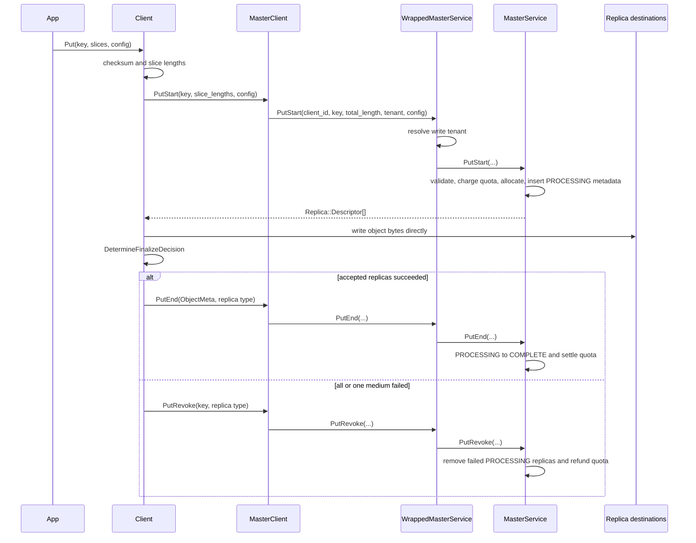

# Put call chain

## End-to-end sequence

A normal write has three phases: reserve metadata and storage, transfer bytes,
then commit or revoke the staged replicas.



The concrete call chain is:

```text
Client::Put
  -> MasterClient::PutStart
  -> WrappedMasterService::PutStart
  -> MasterService::PutStart
       -> AllocateAndInsertMetadata
  <- Replica::Descriptor[]
  -> Client::TransferWrite / storage backend / DFS write
  -> Client::DetermineFinalizeDecision
  -> MasterClient::PutEnd and/or PutRevoke
  -> WrappedMasterService::PutEnd and/or PutRevoke
  -> MasterService::PutEnd and/or PutRevoke
```

Source entry points:

- [`Client::Put`](../../../mooncake-store/src/client_service.cpp#L1853)
- [`MasterClient::PutStart`](../../../mooncake-store/src/master_client.cpp#L578)
- [`WrappedMasterService::PutStart`](../../../mooncake-store/src/rpc_service.cpp#L365)
- [`MasterService::PutStart`](../../../mooncake-store/src/master_service.cpp#L4390)
- [`AllocateAndInsertMetadata`](../../../mooncake-store/src/master_service.cpp#L4119)
- [`MasterService::PutEnd`](../../../mooncake-store/src/master_service.cpp#L4583)
- [`MasterService::PutRevoke`](../../../mooncake-store/src/master_service.cpp#L4850)

## Phase 1: `PutStart`

### Client and RPC preparation

`Client::Put` optionally computes the object checksum, converts the input
slices into a vector of lengths, attaches the client host identifier, and asks
`MasterClient` to start the write. `MasterClient::PutStart` sums the lengths
into the object value length and issues the RPC with its configured tenant.

At the server boundary, `WrappedMasterService` resolves the tenant:

- with multi-tenancy disabled, every write is mapped to the default tenant;
- with multi-tenancy enabled, an empty or invalid tenant is rejected;
- the Master then verifies that the resolved tenant is registered before
  admitting the write.

### Master admission and allocation

`MasterService::PutStart` performs the following work:

1. Builds `ObjectIdentity{tenant_id, user_key}` and validates the replica
   configuration, key, value length, DFS restrictions, and soft-pin request.
2. Selects the optional group identifier associated with the key.
3. Acquires the striped object-operation lock for the scoped object identity.
4. Under a shared snapshot lock and the target metadata shard's exclusive
   lock, rejects a live existing object or cleans up an abandoned processing
   write whose discard deadline has passed.
5. Calls `AllocateAndInsertMetadata`.
6. If tenant quota admission fails, invokes tenant-scoped memory eviction for
   the reported deficit and retries up to the configured internal limit.

`AllocateAndInsertMetadata` first calculates the requested memory charge:

```text
pending memory charge = value_length * requested MEMORY replica count
```

It charges the tenant account before allocating. It then allocates the
requested MEMORY and NoF replicas, optionally appends DISK and DFS replicas,
constructs descriptors, and inserts `ObjectMetadata` whose replicas are
`PROCESSING`. The per-object quota ledger adopts the pending charge, the key is
added to `processing_keys`, and a grouped object is registered with its
tenant-scoped group lease.

Any failure before insertion releases the provisional quota and the RAII-owned
allocations. Allocation failure can also raise an asynchronous memory or NoF
eviction trigger.

### `PutStart` result

The result is a vector of `Replica::Descriptor`, not a success indication for
the data write. At this point:

- storage has been reserved;
- metadata exists but the new replicas are not readable;
- the initiating `client_id` owns finalization;
- the tenant's requested MEMORY capacity is already charged;
- the client still must write every replica required by the write policy.

## Phase 2: direct data transfer

The client uses each descriptor according to its medium:

| Medium | Data path during normal `Put` |
|---|---|
| DISK | `PutToLocalFile` through the configured storage backend |
| MEMORY | `TransferWrite`, using the memory buffer descriptor |
| NoF SSD | `TransferWrite`, using the NoF descriptor |
| DFS | `WriteDfsReplicas` after non-DFS transfers have succeeded |
| LOCAL_DISK | Not created by the normal `Put` allocation path |

The client records success and failure by replica type. The Master is not in
the byte path and therefore relies on the final RPC to publish or discard the
staged replicas.

## Phase 3: finalize

### `PutEnd`

`PutEnd` is the commit operation for the selected replica type. The Master:

1. Locates the object by `(tenant_id, key)` under the target shard's exclusive
   lock.
2. Verifies that the caller is the same `client_id` recorded by `PutStart`.
3. Requires a primary write to be in progress, except for an idempotent retry
   whose targeted replicas are already complete.
4. Changes matching valid replicas from `PROCESSING` to `COMPLETE`.
5. Commits the pending soft-pin action when the first eligible replica becomes
   complete and records the optional checksum.
6. Settles the quota ledger against the number of completed MEMORY replicas.
   Requested but uncommitted MEMORY capacity is refunded.
7. Optionally enqueues SSD offload from completed memory replicas.
8. Removes the key from `processing_keys` when all remaining replicas are
   complete, updates cache accounting, grants the read lease, and publishes
   the stored event.
9. When the operation log is enabled, appends a `PUT_END` record using the
   visible-before-durable path.

After at least one eligible replica is complete, read lookup can return the
object. A medium-specific `PutEnd` permits the flexible dual mode to publish
one successful medium while the other is revoked.

### `PutRevoke`

`PutRevoke` is the abort operation for the selected replica type. It validates
writer ownership and removes matching `PROCESSING` replicas. It releases their
allocations, reconciles the quota ledger, clears processing state when no
primary write remains, and erases the object when no valid replica survives.
DFS allocations are also released through the DFS allocator.

`PutEnd` and `PutRevoke` can both occur for one logical write when flexible
dual placement accepts one medium and rejects the other.

## Finalize policy

`DetermineReplicaWriteMode` and `DetermineFinalizeDecision` define whether a
partial transfer is acceptable.

| Requested MEMORY | Requested NoF | Mode | Finalization rule |
|---:|---:|---|---|
| 1 | 0 | `SINGLE_REPLICA` | End all on success; revoke all on failure |
| 0 | 1 | `SINGLE_REPLICA` | End all on success; revoke all on failure |
| 1 | 1 | `FLEXIBLE_DUAL_REPLICA` | Either medium may be committed independently |
| More than 1 | Any | `RELIABLE_MULTI_REPLICA` | All allocated transfers must succeed |
| Any | More than 1 | `RELIABLE_MULTI_REPLICA` | All allocated transfers must succeed |

Flexible dual outcomes are:

```text
MEMORY success + NoF success -> PutEnd(ALL)
MEMORY success + NoF failure -> PutEnd(MEMORY), PutRevoke(NOF_SSD)
MEMORY failure + NoF success -> PutEnd(NOF_SSD), PutRevoke(MEMORY)
MEMORY failure + NoF failure -> PutRevoke(ALL)
```

Thus a `(1 MEMORY, 1 NoF)` request is a dual-medium attempt with single-medium
degradation, not a guarantee that both media become readable.

## Abandoned writes

Two timeouts have different purposes:

- the discard timeout allows a newer `PutStart` to replace an old object that
  has no completed replica and whose writer did not finalize;
- the release timeout controls when detached replica allocations are actually
  released from the discarded-replica list.

This separation avoids immediately reusing memory that may still be the target
of a delayed transfer from the abandoned writer.

## Batch `Put`

The batch path preserves the same per-key protocol:

```text
Client::StartBatchPut
  -> MasterClient::BatchPutStart
  -> WrappedMasterService::BatchPutStart
       -> MasterService::PutStart for each key
  -> submit and wait for transfers / DFS writes
  -> Client::FinalizeBatchPut
       -> BatchPutEnd grouped by replica type
       -> BatchPutRevoke grouped by replica type
```

If `ReplicateConfig::group_ids` is present, it must align one-to-one with the
keys. Each result is independent. Successful keys can be committed while
failed keys are revoked; the batch is not an atomic multi-object transaction.

## Upsert variants

`UpsertStart` uses the same transfer and finalize structure but has three
metadata cases:

- Absent key: allocate as a normal `PutStart`.
- Existing key, same size: reuse existing buffers and change eligible replicas
  from `COMPLETE` to `PROCESSING`; readers cannot use those replicas until
  `UpsertEnd` completes them again.
- Existing key, different size: stage replacement allocations, preserve the
  existing group and hard-pin identity, and use replacement quota accounting
  until the new representation commits or rolls back.

`UpsertEnd` delegates to `PutEnd`; `UpsertRevoke` delegates to `PutRevoke`.
Upsert does not change a live object's group membership.

