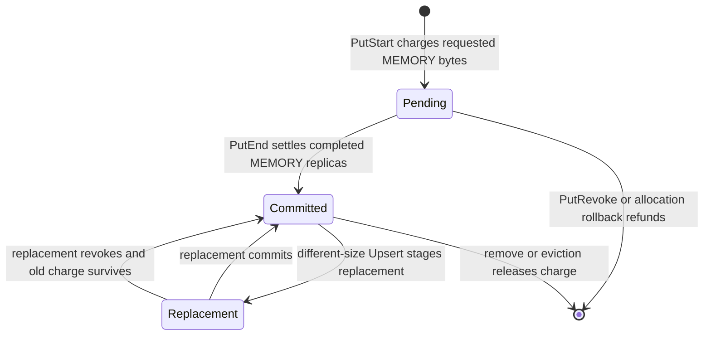

# Tenants, quotas, and object groups

## Model summary

Tenant, quota, and group address different concerns:

| Concept | Purpose | Identity or ownership |
|---|---|---|
| Tenant | Namespace and administrative isolation | Owns objects and one memory quota account |
| Quota | Admission and accounting for tenant MEMORY replicas | Owned by a tenant, settled per object |
| Object | Stored value and replica lifecycle unit | Identified by `(tenant_id, user_key)` |
| Group | Shared lease and eviction coordination hint | Identified by `(tenant_id, group_id)`; contains member keys |

The containment relationship is:

```text
tenant
├── quota account
├── object key A ── quota ledger ── MEMORY replica charges
├── object key B ── quota ledger ── MEMORY replica charges
└── group G
    ├── member key A
    ├── member key B
    └── shared lease
```

A group is not a first-class stored object. It has no payload, replica vector,
quota ledger, or independent placement. Its members remain separately keyed
objects, possibly in different metadata shards.

## Tenant application scenarios

Multi-tenancy is useful when one Mooncake Store cluster serves several models,
teams, inference pools, or workloads that should not share one namespace and
one unconstrained DRAM budget.

Representative scenarios include:

- two model-serving teams use the same logical cache keys without collision;
- a latency-critical workload receives a bounded DRAM allocation while a
  batch workload cannot consume its capacity;
- an operator raises or lowers a tenant policy without rewriting object keys;
- quota pressure reclaims expired memory objects from the tenant causing the
  deficit instead of selecting another tenant's objects.

When strict multi-tenancy is disabled, request tenant identifiers are
normalized to the default tenant and quota enforcement is inactive. When it is
enabled, writes require an explicit valid, registered tenant, including writes
intended for the default tenant.

## Namespace and routing

`TenantId` turns a tenant-local key into a scoped key using a separator that
cannot be confused with normal tenant/key concatenation. The Master hashes the
tenant and user key to select the metadata shard:

```text
metadata shard = hash(tenant_id, user_key) mod 1024
```

The same `user_key` in two tenants denotes two different objects. A group
identifier is also tenant-scoped, but it does not affect this routing rule.

## Quota policy and effective quota

The configured policy is the requested quota. The Master recomputes an
effective quota against the currently registered MEMORY capacity. If total
requested quota fits, requested and effective values match. If it exceeds
capacity, effective quotas are scaled proportionally.

This makes quota a control-plane admission bound over registered distributed
memory, not a reservation of specific segments. Allocation may still fail
because of placement constraints, fragmentation, missing segments, or replica
requirements even when a tenant has unused effective quota.

## What is charged

The primary write charge is:

```text
requested charge = object size * requested MEMORY replica count
```

The account includes in-flight and completed MEMORY replicas. NoF, DISK,
LOCAL_DISK, and DFS replicas are not included in this tenant memory quota.
They may have separate global capacity and eviction mechanisms.

Example: a 64 MiB object requesting two MEMORY replicas receives a 128 MiB
pending charge before allocation descriptors are returned. If only one MEMORY
replica is ultimately committed in a mode that permits degradation, final
settlement retains 64 MiB and refunds the unused 64 MiB.

## Account and ledger roles

Quota state has two levels:

`TenantQuotaAccount`
: One stable account for a tenant across all metadata shards. It holds the
  effective limit and atomically tracks the tenant's total charged bytes. Its
  admission state can be closed during administrative transitions.

`TenantQuotaLedger`
: One ledger embedded in each `ObjectMetadata`. It divides that object's
  contribution into pending, committed, and replacement bytes.



The ledger lets cleanup, replacement, HA replay, and removal reconcile exactly
the bytes owned by one object without recomputing ownership from an unstable
operation phase.

## Quota pressure in the write path

`PutStart` charges before allocating. If the charge exceeds the effective
quota, it receives both `TENANT_QUOTA_EXCEEDED` and a deficit size. The Master
attempts tenant-scoped memory eviction and retries admission. If insufficient
eligible memory can be reclaimed, the write is rejected.

This path has two important boundaries:

- it selects only the tenant that caused the quota deficit;
- ordinary eviction safety still applies, including leases, hard pins, soft
  pins, processing state, busy replicas, and replica availability.

Quota availability does not imply physical allocatability, and physical free
space does not override a tenant quota rejection.

## Group relationship

An object joins a group when its write configuration supplies a non-empty
group identifier. Registration stores the member's user key in
`GroupState::member_keys` and replaces the object's independent lease pointer
with the group's shared `Lease` pointer.

Consequences:

- a read of any member refreshes the shared lease and therefore protects all
  current members from lease-based eviction;
- group names are isolated by tenant through
  `tenant_id.MakeScopedKey(group_id)`;
- every member retains its own object metadata, replicas, checksum, pin state,
  and quota ledger;
- the group cannot transfer quota between its members and cannot cross a
  tenant boundary;
- removing one member unregisters that key; the group entry disappears when
  its member set becomes empty.

Group eviction copies the current member list, partitions members by their
normal `(tenant, key)` metadata shard, acquires shard locks in ascending order,
and revalidates each object. Per-object safety checks can skip a member. The
group therefore coordinates the eviction attempt and lease deadline but does
not provide transactional all-member deletion.

## Choosing the mechanism

Use a tenant when namespace isolation, capacity governance, or tenant-local
reclamation is required. Use a group when related objects should share access
recency and be considered together by memory eviction. Use both when a
tenant-owned collection of related cache entries needs a shared lifetime.

Do not use a group as a substitute for:

- tenant isolation;
- a quota pool or quota sub-account;
- placement affinity;
- atomic multi-key publication or removal;
- a container object that can be read or written by group identifier.

