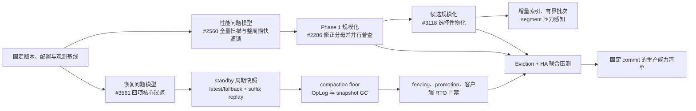
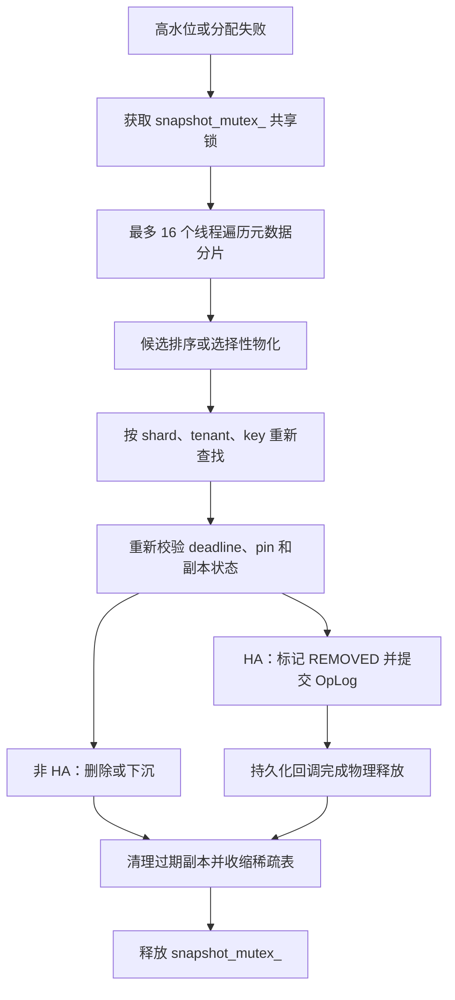
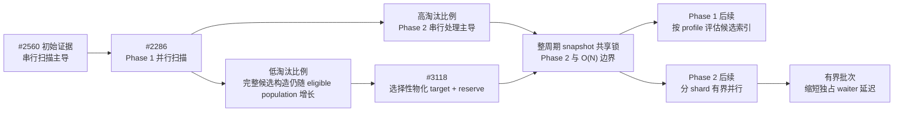
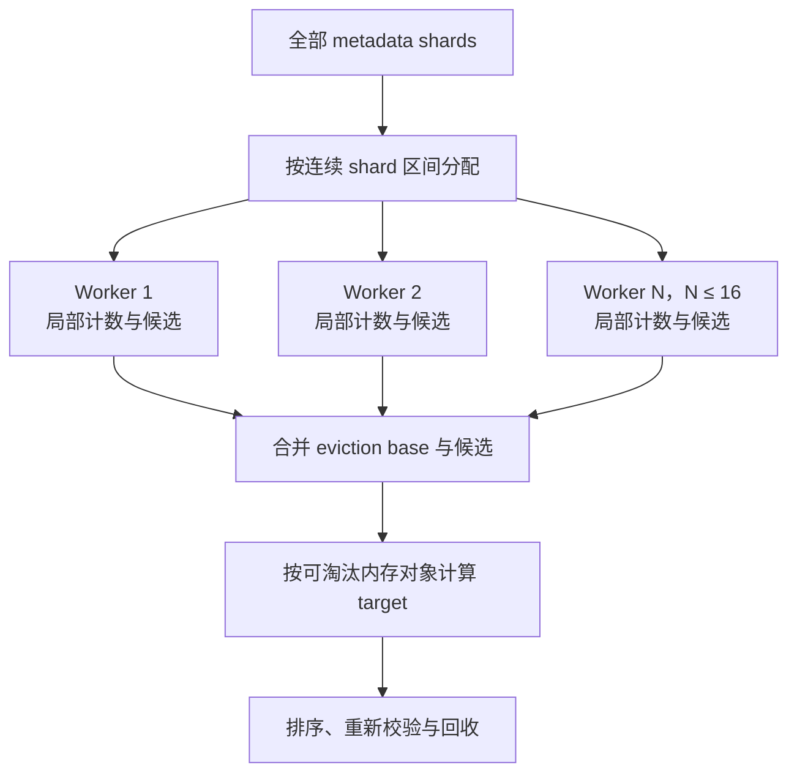
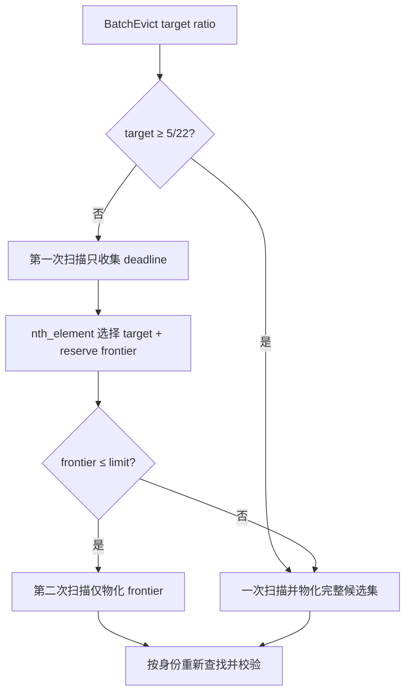
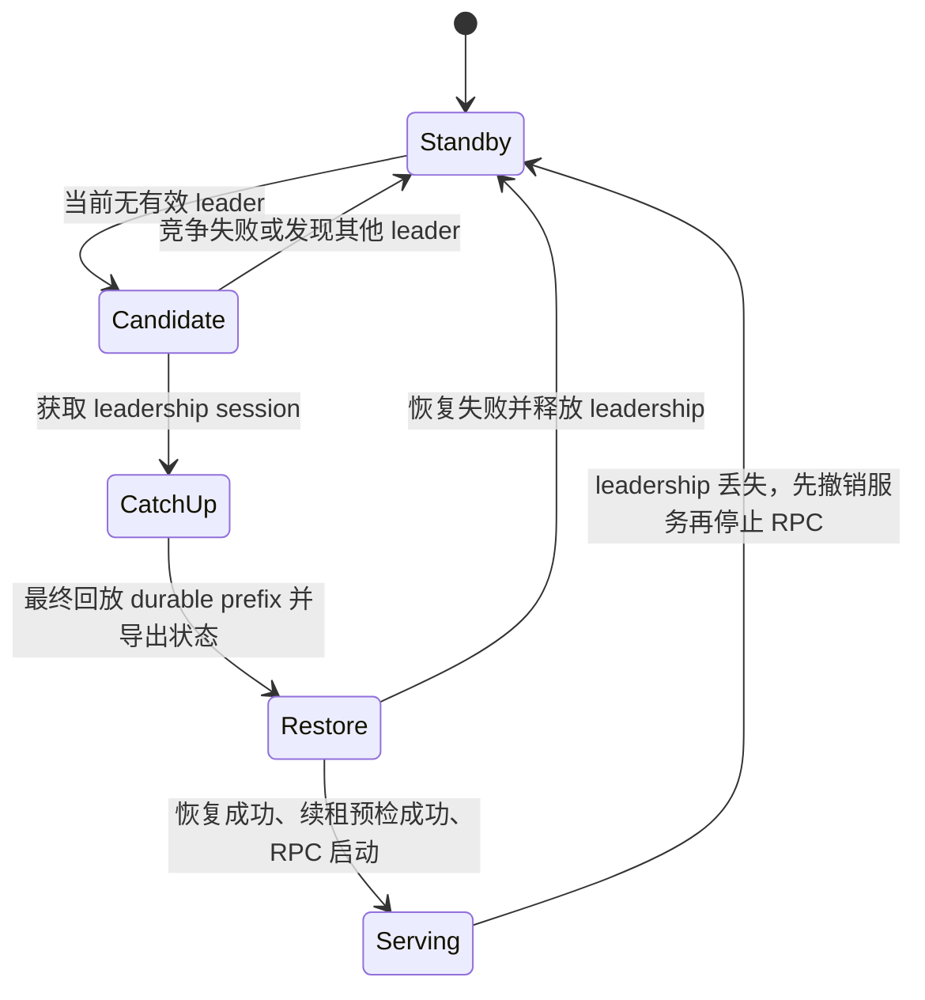
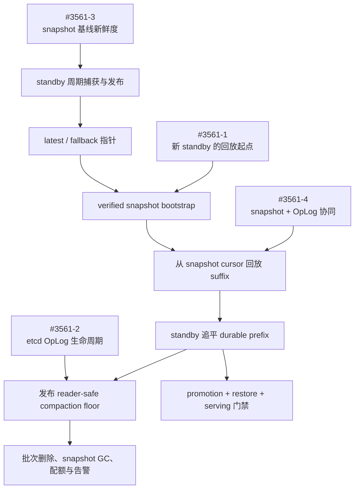

# Mooncake Store 生产架构与社区进展报告：Eviction 与 HA

> 证据快照：Eviction 截至 2026-09-07，HA 截至 2026-09-08
>
> 适用范围：Mooncake Store Master 的分布式 DRAM 淘汰、主备选举、etcd Batch OpLog、快照恢复、主备切换及 Store
> 客户端重连。

## 1. 报告目的与证据边界

本报告整合以下四份材料：

- [Eviction 架构](eviction/architecture.md)
- [Eviction 社区进展](eviction/community-track.md)
- [HA 架构](ha/architecture.md)
- [HA 社区进展](ha/community-track.md)

核心社区记录使用官方页面复核：

- [Issue #2560：`BatchEvict` 全量扫描与快照锁周期](https://github.com/kvcache-ai/Mooncake/issues/2560)
- [PR #2286：Phase 1 并行扫描与淘汰分母修正](https://github.com/kvcache-ai/Mooncake/pull/2286)
- [PR #3118：低淘汰比例候选选择性物化](https://github.com/kvcache-ai/Mooncake/pull/3118)
- [Issue #3561：HA cold bootstrap、OpLog GC 与 snapshot 协同](https://github.com/kvcache-ai/Mooncake/issues/3561)

报告使用三类陈述：

- **实现事实**：由当前代码路径或已有架构文档确认的机制。
- **社区状态**：在证据快照日期前，相关 issue、PR 和 release 的状态。
- **建议方案**：根据实现事实和社区状态推导的生产部署、验证与后续开发方向。

社区状态具有时间边界。部署决策以确切的镜像标签、commit SHA 和能力清单为依据。

## 2. 解决方案总览

建议采用“配置确定性、淘汰可伸缩性、恢复有界性、联合验证”四条主线。当前已合入能力作为部署基线，
社区中的完整设计作为演进目标，各阶段均设置可量化门禁。



| 优先级 | 方案 | 交付结果 |
|---|---|---|
| P0 | 固定 commit 与配置指纹；确认 #2286、#2405、#2508、#3118、#3154、#3168、#3576 的包含关系 | 建立可复现、可审计的运行基线。 |
| P1 | 以 #2560 为性能问题模型；使用 #2286 的 Phase 1 并行普查和正确分母，结合 #3118 的低比例候选物化 | 分阶段控制扫描、候选构造、CPU、临时内存和锁持有时间。 |
| P1 | 以 #3561 为问题定义，接通 fenced writer、standby snapshot、suffix replay 和 promotion 门禁 | 建立可验证的 metadata 恢复链。 |
| P2 | 发布 reader-safe compaction floor，并实施 OpLog 与 snapshot GC | 建立有界冷启动与有界 etcd 空间模型。 |
| P2 | 建立 segment 级压力感知、增量候选索引和有界淘汰批次 | 改善大对象基数与异构 segment 的尾延迟。 |
| P3 | 将 etcd 压力、durable callback、failover 和客户端重连加入统一场景 | 用端到端 SLO、RTO 和字节一致性完成生产验收。 |

> **重点议题｜Issue #2560：从全量扫描识别 `BatchEvict` 的规模边界。**
> #2560 的初始测量定位了串行 metadata scan；#2286 随后并行化 Phase 1，并使高比例场景的主要耗时转移到
> Phase 2；#3118 进一步压缩低比例场景的完整候选集合。三者共同展示了瓶颈随实现版本和淘汰比例迁移的过程。

> **重点议题｜Issue #3561：HA 应按完整恢复链评估。**
> #3561 将 cold bootstrap、OpLog GC、snapshot 更新和 snapshot/OpLog 协同归纳为同一恢复闭环。
> 对应方案是 standby 生成快照、指针化发布、后缀回放、reader-safe retention 和真实 etcd 端到端门禁。

## 3. 架构与结论概览

### 3.1 实现事实

1. Eviction 是周期性批处理机制。Master 每 10 ms 检查全局内存使用率，超过高水位或分配失败后执行
   `BatchEvict`。周期性内存下降来自该批处理模型，前台 SLO 由锁竞争、批次规模、命中率和下沉流量共同决定。
2. `BatchEvict` 在整个周期持有 `snapshot_mutex_` 共享锁，并以最多 16 个工作线程逐分片获取元数据写锁。
   候选发现与实际删除是两个独立临界区，实际删除前会按 `(shard, tenant, key)` 重新查找和校验。
3. 非 HA 模式可在释放元数据分片锁后销毁被淘汰副本；HA 模式先记录逻辑删除，再等待 OpLog 持久化回调完成物理回收。
   因此，HA 模式分别记录“已接受淘汰”和“内存可重新分配”两个时间点。
4. HA 由领导权、元数据 OpLog 复制和快照引导三个相互独立的能力层组成。
   etcd、Redis 和 Kubernetes Lease 均可用于选主；连续 OpLog 复制的当前后端是 etcd。
5. 领导权获取、Master RPC 就绪、Store 客户端切换和数据面恢复是不同阶段。
   恢复完成判据由上述四个阶段共同构成。

### 3.2 社区状态

1. `v0.3.13.post1` 已包含 Eviction 的主要已合入修复：SSD 淘汰比例修正、前台批量查询按分片聚合、
   低比例候选压缩、HA 容量记账修正和稀疏元数据表收缩。
2. Eviction 的下一阶段聚焦两个结构性边界：每轮 O(N) 元数据普查，以及覆盖整个淘汰周期的
   `snapshot_mutex_` 共享锁。异构 segment 下，全局水位也可能晚于局部分配失败。
3. `v0.3.13.post1` 提供了 HA writer、快照格式、分块捕获、恢复校验和 fencing 的基础组件。
   有界冷启动、有界 OpLog 保留和滚动替换使用独立的部署门禁进行确认。
4. 截至 HA 证据日期，standby 生成快照、`latest`/`fallback` 引导和后缀回放的组件已逐步进入 `main`，
   生产配置接线、真实 etcd 端到端门禁、compaction floor、OpLog 清理和快照 GC 由 #3808 继续跟踪。

### 3.3 综合判断

Eviction 与 HA 采用联合生产验收。HA 会把淘汰的物理内存释放延迟到持久化回调；
OpLog 队列饱和或 etcd 抖动会延长这段时间，并可能放大分配失败、重复淘汰和选主稳定性问题。
生产验收需要在同时启用 HA、真实 etcd、目标对象规模和目标淘汰比例的条件下进行。

## 4. Eviction 主架构

### 4.1 触发与批次目标

Master 的后台线程根据全局内存使用率和异步分配失败标志触发淘汰：

```text
SegmentManager 全局使用率 ----+
                              +-> EvictionThreadFunc -> BatchEvict
PutStart 分配失败 ------------+
             设置 need_mem_eviction_
```

目标比例为：

```text
target = max(configured_eviction_ratio,
             used_ratio - high_watermark + configured_eviction_ratio)

lower_bound = max(target / 2,
                  used_ratio - high_watermark)
```

比例的分母定义为“存在可淘汰内存副本且未被 hard pin 的对象数”；总元数据对象数和字节数属于独立统计量。
因此，对象大小、内存副本数、group 和 SSD-only 对象分布都会使实际释放字节比例偏离对象淘汰比例。

### 4.2 核心执行链



每个 census worker 在访问当前分片时持有该分片写锁，并在进入下一分片前释放。
census 形成逐分片观察结果；候选身份的重新查找和最终状态校验为并发变化提供正确性边界。

### 4.3 锁与并发边界

| 阶段 | 锁范围 | 对前台路径的影响 |
|---|---|---|
| 整个 `BatchEvict` | `snapshot_mutex_` 共享锁 | 普通共享锁操作可以并发；需要独占快照锁的管理、快照或卸载操作等待整轮结束。 |
| 元数据普查 | 单个 shard 写锁 | 当前 shard 上的前台查找或修改等待；其他 shard 仍可访问。 |
| 候选选择 | 无 shard 锁 | 不直接阻塞分片访问，但仍持有外层快照共享锁。 |
| 实际淘汰 | 候选所在 shard 写锁 | 重新查找、资格校验和逻辑状态变更均在锁内完成。 |
| group 淘汰 | 先复制 group 成员，再按 shard 顺序逐个加写锁 | 同一时刻最多持有一个成员 shard 锁。 |
| HA 持久化回调 | 快照共享锁，再获取对象 shard 写锁 | 删除 `REMOVED` 副本并完成记账；当前实现中的 buffer 销毁发生在 shard 解锁前。 |

### 4.4 非 HA、SSD 下沉与 HA 回收差异

| 模式 | 逻辑状态变化 | 物理内存释放 | 主要失败边界 |
|---|---|---|---|
| 非 HA | 在 shard 锁内移除副本和更新元数据 | 被选副本延迟到 shard 解锁后销毁 | 重新校验失败时跳过候选。 |
| SSD 下沉 | 增加引用计数并登记 offload task | 下沉成功或允许 force evict 后释放 | 队列失败时默认保留对象，本轮可能没有释放容量。 |
| HA OpLog | 标记副本为 `REMOVED`，提交有序 OpLog | durable callback 重新校验并销毁副本 | reservation、commit、后端持久化或 callback backlog 都会延迟可用容量。 |

## 5. Eviction 社区议题与解决方向

### 5.1 社区议题全景

| 议题 | 机制 | 社区处理 | 生产含义 |
|---|---|---|---|
| [Issue #2560](https://github.com/kvcache-ai/Mooncake/issues/2560)：全量扫描与整周期快照锁 | 每轮遍历 metadata population，并在整个 `BatchEvict` 周期持有快照共享锁 | #2286 并行化 Phase 1；#3118 压缩低比例场景的完整候选集合；#3124 记录保留的 O(N) 边界 | 按实现版本和淘汰比例分别定位 Phase 1、Phase 2 与锁等待。 |
| #2243：SSD 场景一次淘汰接近全部 DRAM 对象 | 早期分母包含 disk-only 对象，这些对象不释放 DRAM | #2286 改用可淘汰内存对象作为分母，并行化第一阶段 | 优先确认版本包含 #2286，再调整水位和比例。 |
| #2405：`BatchExistKey` 在淘汰期间尾延迟升高 | 大批请求逐 key 获取锁，与 census 写锁竞争 | #2405 按 shard 聚合查询并延迟副本销毁 | 直接缓解 eviction 窗口内的查询锁竞争。 |
| #2508：`BatchGetReplicaList` 存在相同访问模式 | 批量副本查询重复获取 shard 锁 | #2508 扩展按 shard 聚合 | 应与 #2405 一并核对。 |
| #3452：淘汰时 Master RSS 峰值或持续偏高 | 大量完整候选对象及淘汰后稀疏 hash map | #3118 减少低比例完整候选；#3576 收缩稀疏 map | `v0.3.13.post1` 同时覆盖两项。 |
| HA term 变化后容量统计异常 | segment 容量跨 term 重复计算或被临时 snapshot reader 释放 | #3154、#3168 修正生命周期记账 | 防止全局使用率偏低并抑制主动淘汰。 |

### 5.2 重点议题：#2560 的性能问题模型

> **热点｜#2560 的价值是建立可分阶段复测的问题模型。**
> 它把总周期拆分为 metadata traversal、candidate construction、`nth_element`、实际淘汰和
> `snapshot_mutex_` 独占等待，并明确记录测试 commit、对象规模、淘汰比例和 workload 约束。

[Issue #2560](https://github.com/kvcache-ai/Mooncake/issues/2560) 于 2026-06-22 基于
commit `ef0312f8` 报告初始测量。该测量早于 #2286 合入，使用单 tenant、全部对象过期、无 pin、
每个对象一个可淘汰内存副本的合成 workload；第一轮已达到淘汰目标，因此未执行 lower-bound pass。

| 初始测量，1M 对象、50% target | 结果 |
|---|---:|
| 非插桩端到端时间 | 约 0.95–1.0 s |
| metadata scan / traversal | 约 73–75% |
| candidate vector collection | 约 28–31%，包含在 traversal 中 |
| 全部 `nth_element` | 约 0.1% |
| `try_evict_group_or_object` | 小于 0.5% |
| 独占 `snapshot_mutex_` 等待 p50 / p95 / max | 约 1.00 / 1.21 / 1.36 s |

这组数据将初始瓶颈定位为串行 metadata traversal 和 candidate construction；
`nth_element` 在该实现和 workload 中占比较小。Issue 同时提出 per-shard、按 lease timeout
组织的辅助结构或 coarse time buckets，目标是把候选发现从每轮全量扫描转为有界提取。

#2286 合入后的同规模 50% target 测量形成第二个证据代际：并行 Phase 1 约 35 ms，占 2.3%；
串行 Phase 2 约 1.24 s，占 82.2%；整轮约 1.5 s，独占快照锁等待 p50 约 1.44 s。
两代绝对时间来自不同 commit 和测量设置，分别用于说明对应实现代际的瓶颈；当前优化优先级以
post-#2286 测量为依据。



#### Phase 1 候选发现方向

#2286 已将该 workload 的并行 Phase 1 降至约 35 ms，占整轮的 2.3%；#3118 进一步控制低比例场景的
完整候选物化量。per-shard lease-timeout index、coarse time buckets 或 lazy generation 仍可将 O(N)
census 转换为有界候选提取，同时把索引维护加入 lease refresh、pin、replica state 和 erase 路径。
该方向适合作为规模复杂度优化，由更大对象基数和低淘汰比例的 profile 确定实施优先级。

索引方案继续使用稳定 identity 传递候选，并以 shard 锁内 revalidation 作为最终决策边界。评估指标集中于
census wall time、索引内存、前台更新延迟、stale entry 比例和 refill 次数。

#### Phase 2 串行执行方向

post-#2286 测量中，Phase 2 约为 1.24 s，占整轮的 82.2%。当前候选循环逐个调用
`try_evict_group_or_object`；每次调用获取候选 shard 写锁，完成 key lookup、资格复核和淘汰。
单个 shard 锁最大持有时间约为 2–3 ms，表明不同 shard 之间具备并行执行空间。

一个可行方向是按 shard 组织候选，使位于不同 shard 的普通对象并行执行，同一 shard 内保持顺序处理。
该结构可以利用现有分片锁的独立性，并保留 key lookup 和锁内 revalidation。group 淘汰跨越多个 shard，
适合采用独立调度域和单一 group 执行权，以保持共享 deadline 与成员淘汰语义。

另一个方向是将 Phase 2 划分为有界批次，并在批次边界调整 `snapshot_mutex_` 的持有范围，从而缩短
独占 waiter 的连续等待时间。HA OpLog、durable callback 和 SSD offload 的处理能力共同构成并行度上限。
这两个方向分别作用于 Phase 2 wall time 和外层锁等待周期，也可以组合评估。

### 5.3 关联 PR：#2286 的 Phase 1 并行重写

> **热点｜#2286 同时修正工作量定义与执行结构。**
> 语义层把目标分母收敛到可释放 DRAM 的对象；执行层把全量 shard census 分配给最多 16 个 worker。

#2286 的直接问题背景是 SSD offload 场景中的目标膨胀。它同时重写了 Phase 1 扫描方式，
因而改变了 #2560 所描述的性能分布：全量 census 继续存在，wall time 从串行遍历转为分片并行遍历。



社区材料记录的 SSD workload 中，总 metadata 对象为 85,622,691，可淘汰内存对象为 3,776,944。
以 5% 为目标时，原计算得到 4,310,991 个 victim，按可淘汰内存对象计算得到约 190,165 个。
PR 报告的一轮执行时间由约 80 秒降至 2.3 秒，实际对象比例回到约 5%。这些数字描述对应社区基准；
生产结果还受对象大小、group、副本数、SSD queue 和 shard 分布影响。

#2286 的核心价值包括：

- 目标对象集合与可释放资源建立一致语义；
- Phase 1 通过分片并行降低 census wall time；
- worker-local 统计减少共享聚合路径上的同步；
- 后续优化可以在同一正确分母上分别处理候选内存和 Phase 2 时延。

### 5.4 关联 PR：#3118 的低比例候选优化

> **热点｜#3118 优化“复制多少完整候选”，#2286 优化“如何完成普查”。**
> #3118 的 cutoff 与 `collect_candidates` 仍位于 Phase 1；它通过缩小完整候选集合降低 Phase 2
> 的输入规模，同时保留全量 census 和逐 shard 加锁。



| 目标比例 | 基线中位数 | #3118 中位数 | 变化 | #3118 完整候选数 |
|---:|---:|---:|---:|---:|
| 1% | 288.1 ms | 88.3 ms | -69.9% | 11,024 |
| 10% | 529.7 ms | 285.1 ms | -47.1% | 110,000 |
| 30% | 898.9 ms | 895.0 ms | 基准中未检测到差异 | 1,000,000 |

选择性路径仍执行全量 census，并可能通过第二次扫描收集完整身份；它重点控制候选构造和临时内存。
高比例路径直接物化完整集合，保持一次扫描的成本模型。详细决策公式见
[PR #3118 专题](eviction/pr/%233118.md)。

令 `N` 为 metadata 对象总数，`M` 为过期且满足初步资格的非 soft-pin 对象数，`K` 为目标数，
`F` 为 `K + reserve` 形成的 frontier。选择性路径的主要成本为：

```text
O(N) 初始 census，逐 shard 获取写锁，保存 O(M) 个 deadline
-> 平均 O(M) 的 nth_element，计算 reserve_cutoff
-> O(N) frontier rescan，再次逐 shard 获取写锁，仅物化 O(F) 个完整身份
-> 平均 O(F) 的 candidate nth_element
-> Phase 2 串行 lookup、锁内 revalidation 与淘汰
```

`reserve_cutoff` 的 `nth_element` 引入平均线性时间和 deadline vector 内存；执行期间继续持有外层
`snapshot_mutex_` 共享锁。`collect_candidates` 会再次扫描全部 metadata shard 并获取
`MetadataShardAccessorRW`。因此，该优化节省的是完整 `{shard, tenant, key, deadline}` identity
的构造、字符串存储和后续 Phase 2 工作集，而不是 metadata traversal 或 shard lock acquisition。

PR 的合成 workload 给出了 shard accessor acquisition 的精确分解，其中 `kNumShards = 1024`：

| 路径 | accessor acquisition 数量 |
|---|---:|
| 基线完整物化 | `kNumShards + K` |
| #3118 选择性路径 | `2 × kNumShards + K` |
| 高比例 pre-bypass | `kNumShards + K` |

选择性路径固定增加一次 1,024-shard frontier scan。PR 报告该额外 acquisition 在 1M/1% 场景约占
9.3%，在 5M/10% 场景约占 0.2%；同时，完整 identity materialization 分别减少 98.90% 和 89.00%。
这一结果说明优化以额外顺序扫描换取更少的动态对象和字符串构造，收益集中在低淘汰比例。

### 5.5 保留的结构性边界与相关议题

#### #3124：O(N) 普查和整周期快照锁

#2286 和 #3118 分别降低 Phase 1 wall time 与低比例候选物化成本；后续设计空间包括：

- 每轮遍历全部元数据；
- 选择性路径可能进行第二次扫描；
- 高淘汰比例回退到全候选物化；
- 第二阶段串行处理候选；
- `snapshot_mutex_` 覆盖完整批次。

**建议方向**：将长期优化目标定义为“增量或索引化候选发现 + 有界批次 + 缩小快照锁生命周期”。
实现继续保留身份化候选和锁内重新校验，使跨临界区数据只携带稳定身份。

#### #2430：异构 segment 的局部压力不可见

全局使用率聚合全部 segment；segment 级指标负责表达小 segment 的碎片和局部容量压力。
结果可能是 `PutStart` 先返回 `NO_AVAILABLE_HANDLE`，随后才由失败标志触发全局批量淘汰。

**短期方向**：在固定构建上比较等大小逻辑 segment、降低高水位和减小单轮比例三种策略；
同时采集每个 segment 的空闲字节和最大连续可分配区间。

**长期方向**：使触发器感知 segment 级容量、碎片和目标分配大小，并将回收目标从纯对象数扩展到可释放字节或受压 segment。
该方向属于设计建议，其交付状态以未来 containing commit 为准。

#### #2506：配置防御性修正

[PR #2506](https://github.com/kvcache-ai/Mooncake/pull/2506) 处理一个配置文件边界场景：JSON
显式使用字符串 `"false"` 时，Python `bool(non_empty_string)` 会将其解释为 `true`。
配置项省略时的默认关闭行为和 JSON 原生布尔值行为保持正常。

### 5.6 Eviction 方案讨论

- 单纯降低 `eviction_ratio` 会减小单轮峰值，但可能提高 O(N) census 的执行频率。
- 单纯降低 `eviction_high_watermark_ratio` 可提前回收，但会减少有效缓存容量并影响命中率。
- 等大小 segment 是明确的部署缓解措施，并增加 segment 数量；分配器和触发器的长期改进继续处理局部压力语义。
- 对高对象基数场景，优化目标同时覆盖平均周期耗时、shard 写锁等待、独占快照锁等待、
  Master RSS 峰值和每轮释放字节的偏差。

## 6. HA 主架构

### 6.1 三层能力模型

| 能力层 | 作用 | 当前边界 |
|---|---|---|
| Leadership | 选主、租约续期和领导权丢失检测 | 支持 etcd、Redis、Kubernetes Lease；只解决唯一主视图。 |
| OpLog replication | 将有序 Master 元数据变更复制到 standby | 当前依赖 etcd；不复制对象字节。 |
| Snapshot bootstrap | 从基线恢复元数据，再回放 OpLog 后缀 | batch-snapshot 组件已进入分阶段集成，生产接线由 #3808 继续跟踪。 |

选主成功只说明候选者拥有有效 lease。新主还必须完成 standby 最终追平、状态导出、
`MasterService` 恢复、领导权 preflight 和 RPC 启动，之后客户端才能观察新 view 并重连。

### 6.2 主备生命周期



服务恢复时间由以下区间共同组成：

```text
旧主停止续租
-> 新 view 获取
-> standby 最终追平
-> promotion context 恢复
-> RPC 可达并发布服务状态
-> Store 客户端观察新 view、重连并重新注册
-> 应用首次成功读取并完成字节校验
```

### 6.3 OpLog 写入与回放

Primary 使用 `OrderedOpLogWriter` 预留容量、分配全局序号并按批次写入 etcd。
批次记录和 durable prefix 在同一个 compare-and-put 事务中推进：

```text
/oplog/<cluster>/batches/<batch_id> = OpLogBatchRecord
/oplog/<cluster>/durable_prefix     = {batch_id, last_seq}
```

Standby 只消费 durable prefix 覆盖的连续批次。缺失批次、prefix 回退、批次或 entry 序号断裂、
checksum 失败和 apply 失败都会阻止完整追平；结构性错误会使 standby 进入 `FAILED`。

Primary 的元数据变更分为两类：

- **持久化前可见**：先改变 live metadata，再将记录送入 writer。
- **持久化后完成**：先标记逻辑状态，等 durable callback 后释放物理资源并完成记账；淘汰属于此类。

`Commit` 成功表示 writer 已接受 entry；durable prefix 的推进是后续持久化检查点。

### 6.4 快照与提升路径

目标架构为：

```text
primary:  fenced ordered batches -----------------------------+
                                                             |
standby:  恢复 latest/fallback snapshot -> 回放 suffix -> 追平
                    |                              |
                    +-> 周期生成并发布校验后的 snapshot
                                      |
new standby:        从 snapshot 启动 -> 回放 suffix
                                      |
retention:          发布 compaction floor -> 安全清理旧批次
```

当前代码包含 batch snapshot descriptor、分块捕获、artifact writer、维护 lease、
`latest`/`fallback` 发布与 provider 等组件。证据快照中的生产构造路径使用
`CatalogBackedSnapshotProvider`；coordinator、batch provider、公开生产开关与保留策略按 #3808 的阶段计划接入。

## 7. HA 社区议题与解决方向

### 7.1 重点议题：#3561 定义的 HA 恢复闭环

> **热点｜Issue #3561 提供了 HA 架构评估的四问题模型。**
> 四项问题分别对应引导起点、历史保留、基线新鲜度和两种恢复机制的协同关系。
> #3808 将相关实现组织为生产接线、故障门禁和 retention 里程碑。



[Issue #3561](https://github.com/kvcache-ai/Mooncake/issues/3561) 的四项原始关切与解决链映射如下：

| #3561 议题 | 已有进展 | 目标闭环 |
|---|---|---|
| 新 standby 从 sequence 1 回放历史成本过高 | #3642 支持 `latest`、`fallback` 和 suffix replay；#3794 增加周期 coordinator | N08 生产接线、公开配置和真实 etcd E2E 门禁。 |
| etcd OpLog 持续增长 | 已定义 compaction floor 等协议基础 | floor-aware rebootstrap、安全批次删除、snapshot GC、floor 发布和实际 pruning。 |
| snapshot 在 standby 初始化时提供一次基线 | #3326、#3447、#3640、#3794 形成捕获、写入、fenced 发布和调度组件 | 周期 pointer 推进、capture 指标和对象存储故障门禁。 |
| legacy primary snapshot 与 OpLog 使用独立运行模式 | 目标架构采用 standby 生成 batch-OpLog snapshot | 生产中持续验证 pointer 推进、新 standby 引导和 suffix 连续性。 |

**建议方向**：以完整恢复链为交付单位。最小闭环同时包含：

1. fenced writer；
2. standby 周期快照和校验后发布；
3. `latest` 损坏时回退 `fallback`；
4. snapshot cursor 后缀回放；
5. reader-safe compaction floor；
6. OpLog 和 snapshot 对象 GC；
7. 真实 etcd 故障注入和容量上限测试。

这一问题模型的价值在于把“恢复速度”和“历史清理”放入同一安全协议：snapshot cursor
定义回放起点，所有活跃 reader 的可恢复边界共同定义 compaction floor，GC 只处理 floor 之前的历史。
因此，bootstrap、promotion 和 retention 使用同一组序号、checksum、pointer identity 和 fencing 规则。

### 7.2 提升恢复的失败原子性：#3497 / #3760 / #3806

#3497 使 restore 失败的候选者保持 non-serving 并释放领导权，建立了正确的 fail-closed 门禁。
#3760 表明单个重叠 descriptor 可导致整次恢复失败。#3806 的方向是丢弃有歧义的副本，同时保留独立有效副本。

**讨论**：fail-closed 建立数据正确性边界，同时引入可用性取舍。容错恢复为每个被丢弃副本记录
tenant、key、segment、offset、原因和恢复决策，并通过对象字节校验确认保留副本可用。
serving 门禁只接收通过恢复校验且具有可信基线的 promotion context。

### 7.3 客户端重连：#3740 / #3743

#3740 观察到新主索引完整，但 Store 客户端仍在旧 endpoint 上重试约两分钟。
解决方向是为运行期连接建立有界超时、及时消费新 MasterView，并把 endpoint switch、remount
和首次成功业务读取共同纳入 RTO，etcd 选主时间作为其中一个分量。

### 7.4 滚动升级和 promotability：#3774

`v0.3.13` 的生产材料尚未形成可保持索引的 Master 滚动升级证据。新 standby 的 `lag=0`
表示当前观测点没有待回放记录；promotability 进一步验证非空、完整且与 primary 对齐的基线。

**建议方向**：增加显式 promotability/readiness 判据，至少联合检查 applied cursor、durable prefix、
key count、segment count、snapshot identity、restore validation 状态和应用字节探针。

### 7.5 物理分配所有权：#3826 / #3858

恢复后的 NoF descriptor 可能引用被新 allocator 再次分配的 offset，形成错误数据读取风险。
当前建议方向是隔离所有权待确认的区间，以受控可用性换取数据正确性；通过 allocator
import/reservation 协议或等价机制恢复物理所有权后，再发布 `COMPLETE` descriptor。

### 7.6 Writer fencing、持久化门禁与 fail-stop

- #3810 将 producer view claim 和每批事务 fencing 接入生产 writer。
- #3885 防止 `PutEnd` 在 reservation 或 admission 失败时暴露 `COMPLETE`，但 accepted entry
  与后端持久化属于两个检查点。
- #3923 曾提出 writer terminal failure 后由 supervisor fail-stop；证据日期的状态存在页面与搜索结果不一致，
  必须通过 containing merge commit 或替代 PR 验证实际行为。
- #3860 缓解 OpLog/eviction 压力下的重复淘汰，并隔离 leadership keep-alive 与通用 etcd client reset；
  完整持久化门禁由 writer admission、durability 和 supervisor lifecycle 共同组成。

### 7.7 其他社区议题

报告保持对相关社区工作的广覆盖，重点议题之外还包括：

| 记录 | 讨论范围 | 建议验证 |
|---|---|---|
| #3496 | etcd 命名测试与生产 etcd 路径的覆盖一致性 | 使用外部真实 etcd 执行 bootstrap、poll、promotion 和 backend retry。 |
| #3761 | legacy 非 OpLog snapshot 恢复后的 lease 语义 | 以持久化时间、恢复时间和对象可见性验证 lease 重建策略。 |
| #3638 | P2P HA promotion 的 OpLog sequence 所有权 | 比较本地 applied sequence、存储 latest sequence 和新 writer 起始值。 |
| #3808 | batch-snapshot 生产接线、retention、身份和可观测性总路线 | 按里程碑和 containing commit 维护能力矩阵。 |
| #2584 | `BatchEvict` 可重复规模与锁等待 benchmark | 使用相同对象数和比例进行版本对比，再以生产分布复核。 |
| #3124 | 选择性物化后的 O(N) 边界 | 将 census、materialization、Phase 2 和独占锁等待分别计时。 |

## 8. Eviction 与 HA 的交叉讨论

### 8.1 淘汰完成具有两个时间点

HA 开启后，淘汰存在“逻辑删除已提交”和“持久化回调已释放内存”两个时间点。
如果运维只观察 `evicted_count`，可能误判当前已有足够可分配容量。建议同时观察：

- attempted/successful eviction 数量与字节；
- OpLog pending entries、committed queue 和 callback queue；
- durable sequence 与 applied sequence；
- allocator active bytes 与实际分配失败；
- 从提交淘汰到物理容量可用的延迟。

### 8.2 OpLog 背压会放大内存压力

etcd 延迟、writer queue 饱和或 callback backlog 会延迟 `REMOVED` 副本回收。
此时继续按逻辑淘汰计数推进批次，可能出现“指标显示已淘汰，但 `PutStart` 仍失败”的窗口。
解决方向包括：

1. 将 durable callback 进度纳入淘汰触发和完成指标；
2. writer terminal 或长期饱和时停止无效重复扫描；
3. 对回调中的 buffer 销毁锁范围进行基准测试，评估是否可安全移到 shard 解锁之后；
4. 将 etcd 故障、队列压力、Eviction SLO 和 HA 功能组合为同一测试场景。

第 3 项是基于现有锁结构的设计建议，需要在保持 replica ID 复核、quota 记账和对象生命周期安全的前提下实现。

### 8.3 容量记账会影响淘汰触发

HA term 切换、snapshot reader 和 segment 生命周期中的容量重复计算或错误释放会使全局使用率失真。
#3154 和 #3168 是 Eviction 与 HA 的共同前置修复。验收必须比较 term 切换前后的 mounted capacity、
`master_total_capacity_bytes`、allocator 实际容量和 leader 切换结果。

### 8.4 快照锁竞争与恢复操作

`BatchEvict` 持有整周期快照共享锁，需要独占快照锁的管理和生命周期操作会等待。
在大对象基数或高淘汰比例下，这会直接影响 snapshot、unmount 或其他恢复边界的时延。
因此，未来缩小快照锁范围需要与 snapshot capture 一致性协议共同设计，并在 Eviction 与 snapshot
两条路径上使用统一的状态边界。

## 9. 实施路线细化

以下内容细化第 2 节的方案。社区交付状态与报告建议分别记录。

### P0：建立可复现基线

1. 固定 Master、Store client 和 etcd 的版本、镜像摘要及 commit SHA。
2. 至少以 `v0.3.13.post1` 作为已发布基础，并逐项核对所需 post-release PR 的 containing commit。
3. 在同一时间轴采集 Eviction、OpLog、领导权、客户端切换、allocator 和应用 SLO 指标。
4. 使用真实 etcd 和生产对象分布重复执行 fill、evict、failover、refill 流程。

### P1：建立正确性门禁

1. 确认 #2286、#2405、#2508、#3118、#3154、#3168、#3576 已包含。
2. HA 构建必须具备 restore fail-closed、producer-view fencing、ReplicaID 保留和有界 promotion restore。
3. 对 `PutEnd`、remove 和 eviction 分别验证 admission 失败、持久化失败与 callback 延迟行为。
4. 为 NoF、LOCAL_DISK、DFS 分别验证 descriptor 与物理分配所有权。

### P2：完成有界恢复闭环

1. 接通 standby 周期 snapshot、`latest`/`fallback` 发布和新 standby 引导。
2. 定义 reader-safe compaction floor，并在 rebootstrap 成功后清理旧 batch。
3. 为 snapshot artifact、pointer 和 OpLog 分别建立 GC、配额、告警和灾难恢复流程。
4. 将 etcd `NOSPACE`、损坏 `latest`、对象存储故障和网络分区纳入门禁。

### P3：降低规模相关抖动

1. 设计增量或索引化 eviction candidate 数据结构，减少每轮 O(N) 普查。
2. 将淘汰工作拆为有界批次，评估缩小 `snapshot_mutex_` 生命周期。
3. 增加 segment 级压力和碎片感知，避免全局水位晚于局部分配失败。
4. 评估 HA durable callback 中 allocator deallocation 的锁外执行方案。

## 10. 联合验收标准

候选构建只有在重复测试中同时满足以下条件，才能进入生产：

- 正常水位触发早于分配失败，周期性 `NO_AVAILABLE_HANDLE` 计数保持为零；
- 每轮实际对象淘汰比例和释放字节量处于预期范围；
- eviction 窗口内查询、写入和应用 p99 满足 SLO；
- OpLog 队列压力下，逻辑淘汰与物理内存释放延迟有明确上限；
- standby 从有效 snapshot 恢复非空基线，并只回放必要后缀；
- promotion 使用可信 cursor，restore 或 fencing 错误使候选保持 non-serving；
- 已确认写入的对象在旧主失效后仍存在且字节一致；
- Store 客户端在定义的 RTO 内完成 endpoint 切换、remount 和首次成功读取；
- term 切换前后 ReplicaID、segment allocation、容量和 key count 保持一致；
- etcd 增长、snapshot 大小、capture pause、bootstrap 时间、promotion RSS 和 replay 时间均有上限；
- 冷启动、滚动替换、进程终止、网络中断、etcd 重启、对象存储失败、snapshot fallback
  和 `NOSPACE` 注入均通过相同正确性标准。

## 11. 版本选择结论

`v0.3.13.post1` 可作为 Eviction 已知修复和 HA 基础组件的最低发布基线。完整 HA 生产能力通过
batch snapshot 生产接线、有界 retention、真实 etcd 端到端门禁和部署级能力清单共同确认。
生产环境使用固定 commit，并持续运行经过验证的 standby；升级或回滚后重新执行 Eviction 与 HA 联合验收。
