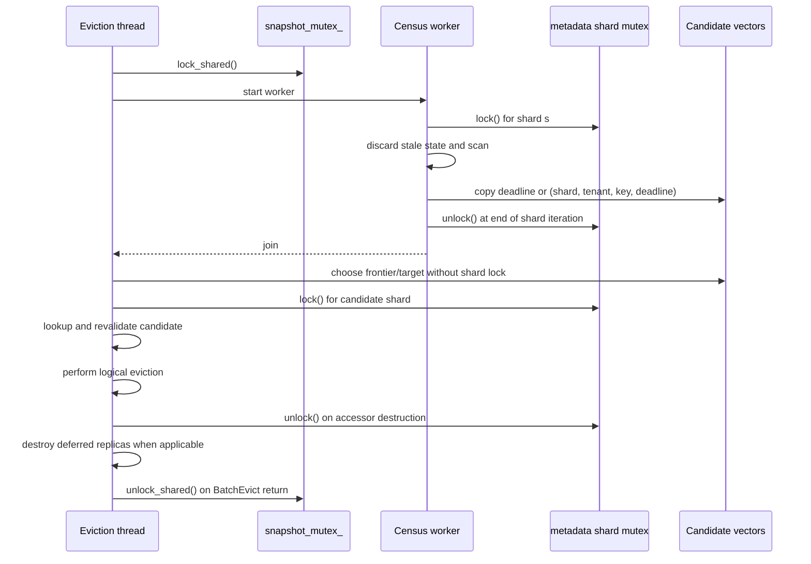
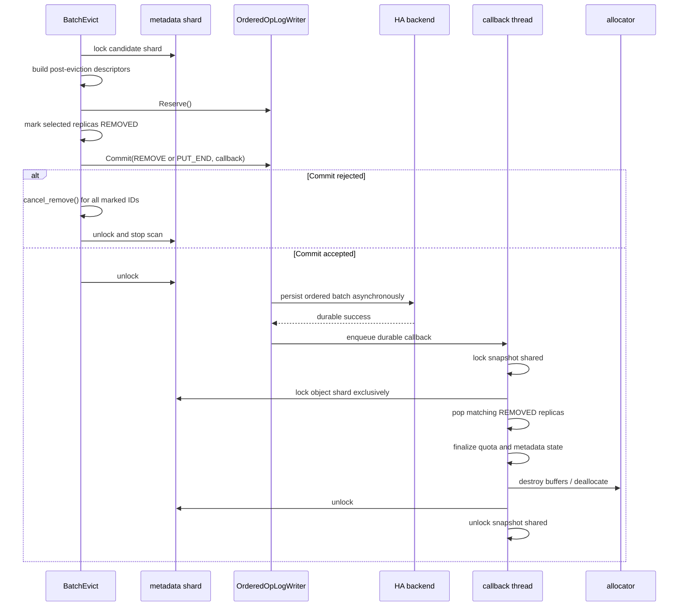

# MasterService memory-eviction architecture

> Source snapshot: 2026-09-08
>
> Scope: global distributed-DRAM eviction in `MasterService::BatchEvict`,
> including grouped objects, optional SSD offload, and the HA OpLog path.

## Purpose

This document describes the implementation call chain from the
`MasterService` background thread to candidate census and object reclamation.
It concentrates on mutex acquisition and release boundaries. The production
symptoms, upstream issues, and release guidance are covered separately in
[community-track.md](community-track.md).

The central concurrency rule is:

> `BatchEvict` retains a shared snapshot lock across the cycle, but it does not
> retain metadata-shard locks between census and eviction. Each object is
> identified by `(shard, tenant, key)`, looked up again, and revalidated while
> holding the target shard exclusively.

## Component map

```mermaid
flowchart LR
    Put[PutStart allocation] -->|allocation failure| Flag[need_mem_eviction_]
    Usage[SegmentManager memory usage] --> Trigger[EvictionThreadFunc]
    Flag --> Trigger
    Trigger --> Batch[BatchEvict]

    Batch --> Barrier[snapshot_mutex_: shared]
    Barrier --> Census[parallel candidate census]
    Census --> Shards[metadata shard mutexes: exclusive]
    Census --> Rank[nth_element / frontier selection]
    Rank --> Apply[serial candidate application]
    Apply --> Recheck[lookup and revalidation under shard lock]

    Recheck --> Direct[non-HA removal]
    Recheck --> HA[HA REMOVED transition]
    Recheck --> Group[group member traversal]
    Recheck --> Offload[optional SSD offload]

    Direct --> Alloc[AllocatedBuffer destruction]
    HA --> Writer[OrderedOpLogWriter]
    Writer --> Durable[durable callback]
    Durable --> Alloc
    Group --> Direct
    Group --> HA
    Offload --> Direct
```



The relevant implementation units are:

- [`MasterService`](../../../mooncake-store/include/master_service.h) owns the
  eviction thread, trigger flags, snapshot mutex, metadata shards, and
  discarded-replica list.
- [`EvictionThreadFunc`](../../../mooncake-store/src/master_service.cpp#L9114)
  evaluates global memory pressure every 10 ms.
- [`BatchEvict`](../../../mooncake-store/src/master_service.cpp#L10056)
  performs census, selection, revalidation, and eviction.
- [`EvictGroupOrObject`](../../../mooncake-store/src/master_service.cpp#L1675)
  expands a group and visits its member shards.
- [`OrderedOpLogWriter`](../../../mooncake-store/src/ha/oplog/ordered_oplog_writer.cpp)
  makes HA mutations durable and dispatches finalization callbacks.
- [`AllocatedBuffer`](../../../mooncake-store/src/allocator.cpp#L64) returns a
  memory allocation to its allocator from its destructor.

## End-to-end call chain

### 1. Thread creation and trigger

`MasterService` starts one eviction thread during construction and joins it during destruction. 
The thread repeatedly executes this decision:

```text
EvictionThreadFunc
  |
  +-- read SegmentManager::GetMemoryUsage().used_ratio()
  |
  +-- used ratio > high watermark?
  |      yes -> calculate target and lower-bound ratios
  |
  +-- need_mem_eviction_ && eviction_ratio_ > 0?
  |      yes -> calculate target and lower-bound ratios
  |
  +-- BatchEvict(target, lower_bound)
  |
  +-- otherwise, periodically discard expired processing replicas
  |
  `-- sleep 10 ms
```

The explicit trigger flag is set when `AllocateAndInsertMetadata` cannot allocate the requested memory replica 
even though enough memory segments are mounted. 
It is an asynchronous signal: the failing `PutStart` returns `NO_AVAILABLE_HANDLE`; 
the background thread performs reclamation on a later iteration.

The ratios passed to `BatchEvict` are:

```text
target = max(configured_eviction_ratio,
             used_ratio - high_watermark + configured_eviction_ratio)

lower_bound = max(target / 2,
                  used_ratio - high_watermark)
```

Both ratios are applied to the count of evictable objects, not directly to
bytes.

### 2. Batch-level snapshot barrier

After preparing its local helper functions, `BatchEvict` acquires:

```cpp
std::shared_lock<std::shared_mutex> shared_lock(snapshot_mutex_);
```

This RAII object remains in the `BatchEvict` function scope. 
It is released on the early `total_eviction_base == 0` return or at the end of the function.
Consequently, it covers:

- candidate census and optional frontier recollection;
- candidate ranking;
- first- and second-pass eviction;
- expired-discard release;
- sparse metadata-map shrinking;
- trigger-state and metric updates.

The shared mode allows ordinary operations that also take the snapshot mutex in shared mode to proceed. 
An operation requiring the snapshot mutex exclusively must wait for the entire batch.

### 3. Parallel candidate census

The census partitions all metadata shards across at most 16 workers. 
Each worker processes its assigned shards sequentially:

```text
for each assigned shard
  acquire metadata_shards_[s].mutex EXCLUSIVE
    discard expired processing/replication/offload/promotion state
    visit every tenant and object in the shard
    count objects and evictable objects
    record an expired object's deadline or full identity
  release metadata_shards_[s].mutex
```

`MetadataShardAccessorRW` acquires the shard's `SharedMutex` exclusively in its constructor. 
Its `SharedMutexLocker` member releases the mutex in the accessor destructor at the end of the loop iteration. 
Workers operate on disjoint shard ranges, so up to 16 different shards can be locked concurrently. 
A worker does not retain one shard lock while moving to the next shard.

The census uses a write accessor even though candidate inspection is read-only 
because `DiscardExpiredProcessingReplicas` runs first and can mutate metadata, task tables, quota accounting, and the discarded-replica list.

An object contributes to the eviction base when it:

- is not hard-pinned; and
- has at least one complete memory replica with reference count zero.

It becomes an immediate first-pass candidate when its eviction deadline has expired and it has no active soft pin. 
An expired, soft-pinned object is saved for the lower-bound pass only when soft-pin eviction is enabled. 
Grouped objects use the shared group eviction deadline.

### 4. Candidate materialization and ranking

After all workers are joined, no census shard lock remains held. 
The main thread merges worker-local counters and candidate data.

For target ratios at or above approximately 22.7%, the census directly copies full candidate identities. 
For smaller ratios it initially copies only lease deadlines, uses `std::nth_element` to find a cutoff with reserve slack, 
and rescans shards to materialize identities near that cutoff. 

The reserve is the larger of 1,024 objects or 10% of the primary target, subject to the compact frontier limit. 
A short frontier caused by concurrent metadata changes falls back to full candidate materialization.

The durable candidate representation is intentionally an identity, not an iterator:

```cpp
struct Candidate {
    size_t shard_idx;
    TenantId tenant_id;
    std::string key;
    std::chrono::system_clock::time_point lease_timeout;
};
```

This is the handoff boundary between census and mutation. 
Metadata can change after a shard lock is released, so retaining a map iterator or an `ObjectMetadata&` across the boundary would be unsafe.

### 5. Serial eviction and revalidation

Candidate application is serial within one `BatchEvict` invocation. 
For each selected identity, `try_evict_group_or_object` performs a fresh lookup while holding the candidate's shard exclusively.

For an ungrouped object, the critical section is:

```text
acquire trigger shard EXCLUSIVE
  find tenant and key
  recheck deadline
  recheck soft pin when the pass must preserve soft pins
  recheck that an evictable memory replica still exists
  persist/mark for HA, or remove/offload for non-HA
  update accounting and publication state
  erase invalid object and empty tenant when applicable
release trigger shard
destroy deferred selected replicas outside the shard lock (non-HA)
```

A missing tenant/key or a failed eligibility check is a normal race outcome; the candidate is skipped. 
The first pass continues beyond its initial partition when revalidation skips candidates so it can still reach its target.

## Mutex acquisition and release map

The table lists locks directly visible in the eviction call chain. 
Internal allocator, queue, quota, and OpLog locks can be acquired transitively by the called subsystem.

| Stage | Mutex and mode | Acquisition | Release | Protected work |
|---|---|---|---|---|
| Batch barrier | `snapshot_mutex_`, shared | Before phase 1 | Function return | The complete census-to-reclamation cycle |
| Census | one metadata-shard mutex, exclusive | `MetadataShardAccessorRW` construction | End of that shard's loop iteration | Stale-task cleanup and full shard scan |
| Frontier recollection | one metadata-shard mutex, exclusive | Collector enters a shard | Collector leaves that shard | Candidate identity copy |
| Candidate selection | none of the metadata-shard mutexes | N/A | N/A | `nth_element`, cutoff selection, vector traversal |
| Ungrouped eviction | candidate shard mutex, exclusive | Fresh lookup begins | `try_evict_group_or_object` returns | Revalidation and logical metadata mutation |
| Group discovery | group-domain mutex, shared | `GetGroupMemberKeys` | The membership copy returns | Copy member keys only |
| Group eviction | one member shard mutex, exclusive | Before visiting that shard's members | End of that shard iteration | Member lookup, validation, and eviction callback |
| Group membership removal | group-domain mutex, exclusive | `EraseMetadata` calls `UnregisterGroupMember` | Membership update returns | Remove an erased key and possibly its empty group; nested inside the object shard lock |
| Discard-list splice | `discarded_replicas_mutex_`, exclusive | End of stale-task cleanup when local discards exist | After splice | Transfer deferred stale replicas to the global list |
| Discard release | `discarded_replicas_mutex_`, exclusive | Before `remove_if` | After expired entries and their replicas are destroyed | Expired discarded-replica reclamation |
| HA writer enqueue | `OrderedOpLogWriter` internal mutex, exclusive | `Reserve` and separately `Commit` | Each method return | Queue capacity, sequence assignment, pending entry |
| HA durable finalize | `snapshot_mutex_` shared, then object shard exclusive | Callback after durable write | Callback return | Pop `REMOVED` replicas and finalize metadata/quota state |
| Map shrink | one affected shard mutex, exclusive | Before visiting the shard's tenant maps | End of shard iteration | Rehash sparse metadata maps |

The declared `MasterService` order relevant to this path is:

```text
snapshot_mutex_
  -> metadata shard mutex
    -> tenant quota table or segment-related internal mutex
      -> soft-pin deadline index mutex
```

The snapshot lock is therefore acquired before the shard lock throughout this path. 
The code never upgrades a shard lock from shared to exclusive; it starts with the required exclusive mode. 
Stale-task cleanup briefly nests the discard-list mutex under the shard lock. 
Erasing grouped metadata similarly nests the group-domain write lock under the shard lock, 
although the initial group membership read is deliberately completed before member-shard traversal.

## Concrete lock timeline

The following sequence shows that the census lock and mutation lock are different critical sections:



There is no atomic snapshot of all metadata shards. 
The outer snapshot mutex prevents snapshot lifecycle conflicts, but foreground metadata operations can still run on unlocked shards between census and application. 
Correctness comes from identity-based lookup and revalidation, not from retaining the census view.

## Actual object reclamation

### Non-HA path

With OpLog disabled, `try_evict_or_offload` ultimately calls `PopReplicasWithCacheTotalAccounting`. 
Selected `Replica` instances are moved out of `ObjectMetadata` while the shard lock is held. 
The path also updates cache-total accounting, dynamic-replication state, tenant quota usage, removal publication, and possibly erases invalid object metadata.

The selected replicas are moved into the caller-owned `deferred_replicas` container. 
The candidate helper returns, its `MetadataShardAccessorRW` is destroyed, and only then does the caller clear `deferred_replicas`. 
Destruction of a memory `Replica` destroys its `AllocatedBuffer`; the buffer destructor calls `BufferAllocatorBase::deallocate`.

For the selected replicas, the practical sequence is therefore:

```text
metadata removal under shard lock
  -> shard unlock
    -> Replica destruction
      -> AllocatedBuffer destruction
        -> allocator deallocate
```

This deferred destruction keeps allocator deallocation out of the metadata critical section. 
Cleanup performed transitively by `EraseMetadata` can still run under the shard lock; 
the statement above applies specifically to the memory replicas selected by `evict_replicas`.

### Offload-on-evict path

When offload-on-evict is enabled and the object has no local-disk replica, the eviction path attempts to queue one evictable memory replica for SSD offload.
It increments that replica's reference count and records an offloading task while holding the metadata shard lock. 
Other unreferenced memory replicas can be removed immediately.

If queueing fails, the default behavior leaves the object in memory for a later cycle. 
`offload_force_evict` permits immediate removal on queue failure or when the per-cycle offload cap has been reached. 
Thus a successful candidate lookup does not necessarily release memory in that cycle.

### HA OpLog path

With OpLog enabled, `BatchEvict` separates logical removal from physical reclamation:



`Commit` means accepted into the ordered writer's in-memory queue; it does not mean durable. 
Until the callback runs, the replica remains in metadata with status `REMOVED` and its buffer remains allocated. 
The durable callback `FinalizeRemovedReplicasAfterDurable` rechecks the tenant, key, status, and replica IDs before popping the replicas.

The callback declares its `erased_replicas` vector after its snapshot and shard lock objects. 
C++ reverse destruction order therefore destroys that vector, including its `AllocatedBuffer` objects, before the shard accessor is destroyed. 
In the current HA path, physical allocator deallocation occurs while the metadata-shard lock is still held. 
This differs from the explicit deferred destruction in the non-HA path.

If OpLog reservation fails, the batch stops at that candidate. 
A pending-limit failure leaves `need_mem_eviction_` set so a later cycle retries. 
Other writer terminal failures clear the trigger. 
If marking succeeds but `Commit` rejects the entry, the path restores each marked replica to its prior non-removed state before releasing the shard.

## Grouped-object path

A candidate may represent one member of a group. 
The path first acquires the trigger shard, copies `group_id`, and releases the trigger shard before group expansion. 
`GetGroupMemberKeys` then acquires the group-domain mutex in shared mode, copies the member keys, and releases that mutex before any member shard is acquired.

Members are partitioned by shard in an ordered map. 
The implementation visits shards in ascending index order, with one `MetadataShardAccessorRW` scoped to one map iteration. 
It therefore holds at most one metadata-shard mutex at a time. 
Each member is looked up again and checked for hard pin, lease expiry, soft pin, and an evictable replica while its shard is locked.

The member callback executes the same non-HA or HA object path while that member's shard remains locked. 
Non-trigger invalid members can be erased in the callback. 
After traversal, the trigger shard is reacquired to erase the trigger metadata if necessary. 
A later candidate for an already-processed member simply fails lookup or eligibility revalidation.

The group deadline makes candidate ranking group-aware, but reclamation is best-effort at member granularity: a member that is hard-pinned, busy, or no longer expired is skipped during final validation.

## Lower-bound pass and final cleanup

The first pass prefers expired objects without active soft pins. 
After it finishes, `ReleaseExpiredDiscardedReplicas` destroys expired deferred processing replicas while holding `discarded_replicas_mutex_`, 
with no metadata-shard lock held by `BatchEvict`.

If the first pass plus discarded release does not reach the lower-bound count, the second pass runs:

- Pass A scans for remaining no-soft-pin objects at or below a selected deadline.
- Pass B can additionally select soft-pinned objects when configured.

Each second-pass shard scan copies `(tenant, key)` pairs under that shard's exclusive lock, 
releases the scan lock, and then sends each identity through the same lookup-and-revalidation helper. 
The scan lock is never carried into group expansion.

Finally, `BatchEvict` performs post-eviction bucket reclamation. 
Erasing entries from a tenant's `std::unordered_map` reduces its live size but does not reduce its bucket array. 
Without an explicit rehash, a shard that once contained a large number of keys can therefore retain its peak bucket memory after most of those keys have been evicted.

Here, a *bucket* is a logical partition in a C++ hash table's bucket array, rather than a Mooncake memory segment or object-storage unit. 
Mooncake first hashes the tenant-scoped object identity into one of 1,024 metadata shards. 
Within that shard, `MetadataShard::tenants` selects the tenant, and `TenantState::metadata` is an `std::unordered_map<std::string, ObjectMetadata>` whose bucket array organizes that tenant's object keys. 
The key hash selects a bucket, and entries assigned to the same bucket are handled as hash collisions. 
The load factor is the number of live entries divided by the bucket count; as it rises, the map grows the bucket array and redistributes entries to preserve average constant-time lookup. 
Bucket count and live object count are therefore separate: ordinary erase operations reduce the latter without reversing bucket-array growth. 
This cleanup shrinks only each tenant's `metadata` map; it does not rehash the shard's outer `tenants` map or the other maps in `TenantState`.

The batch records a shard in `evicted_shards` when an eviction result reports at least one removed object. 
During final cleanup, it revisits only those recorded shards, acquires each shard's metadata mutex exclusively, 
and calls `ShrinkBucketsIfSparse` for each tenant's metadata map in the shard. 
A map is rehash-eligible only when its bucket count exceeds 1,024 and its live size is less than one quarter of its bucket count. 
The requested post-rehash capacity is twice the live size, 
which releases most of the excess bucket storage while leaving growth headroom and avoiding churn for small maps.

Rehashing invalidates iterators into the tenant metadata map. 
The exclusive shard lock prevents concurrent metadata access, and the cleanup loop iterates the shard's outer `tenants` map rather than the nested metadata map being rehashed, so it retains no invalidated metadata iterator. 
The outer shared snapshot lock remains held throughout this cleanup and is released only after metrics, logging, and trigger-state updates complete.

## Derived concurrency properties

The source structure implies the following behavior:

- Candidate census is globally O(number of metadata objects), even when only a small fraction is ultimately evicted. 
  Compact materialization reduces copied identities but does not remove the initial scan.
- Foreground access to the same metadata shard waits while a census worker,
  recollector, candidate eviction, or map shrink holds that shard exclusively.
- Shards outside the current critical section remain available; there is no all-shard metadata lock.
- The shared snapshot lock is a lifecycle barrier, not an eviction-cycle mutex. 
  The single background thread normally prevents overlapping cycles, but direct test or administrative calls are not serialized by this lock.
- An exclusive snapshot operation waits for the complete `BatchEvict` scope, including selection work that holds no shard lock.
- Candidate metadata is advisory. 
  Final eligibility is determined only after reacquiring the object shard.
- Non-HA logical removal and allocator reclamation are separated by the shard unlock for selected replicas. 
  HA logical removal and reclamation are also temporally separated, but the later durable callback deallocates its popped buffers before releasing the shard lock.
- `BatchEvict` reports HA eviction progress when removals are accepted into the OpLog path; 
  immediately reusable capacity depends on durable callback progress.

## Validation anchors

The most relevant focused tests are:

- [`master_service_test.cpp`](../../../mooncake-store/tests/master_service_test.cpp)
  for trigger behavior and post-eviction map shrinking;
- [`offload_on_evict_test.cpp`](../../../mooncake-store/tests/offload_on_evict_test.cpp)
  for queue, pin, and force-eviction behavior;
- [`master_service_ha_test.cpp`](../../../mooncake-store/tests/ha/master_service_ha_test.cpp)
  for durable finalization, reservation failure, writer fencing, and rollback
  of rejected commits.

When changing lock scope, validation should cover both logical visibility and allocator capacity. 
In HA mode these are distinct checkpoints: status changes at OpLog submission, 
while physical memory becomes reusable only after the durable callback removes and destroys the replicas.
