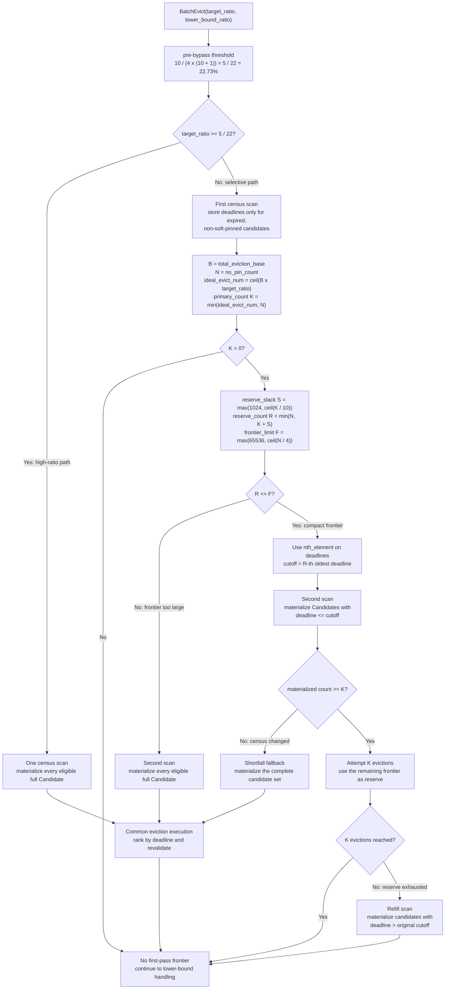

# PR #3118: selective `BatchEvict` candidate materialization

> Scope: candidate-materialization decisions introduced by
> [PR #3118](https://github.com/kvcache-ai/Mooncake/pull/3118). The change
> preserves eviction eligibility and ordering; it changes when complete
> candidate identities are copied.

## Decision and calculation flow



## Quantity meanings

| Symbol | Code name | Meaning |
| --- | --- | --- |
| `B` | `total_eviction_base` | Objects contributing to the ratio denominator because they have an evictable memory replica and are not hard-pinned. |
| `N` | `no_pin_count` | Expired, eligible objects without an active soft pin. |
| `K` | `primary_count` | Maximum number of non-soft-pinned objects requested from the first pass. |
| `S` | `reserve_slack` | Backup capacity for candidates that fail execution-time revalidation. |
| `R` | `reserve_count` | Total intended frontier size, including the `K` primary entries and up to `S` backup entries. It is not the eviction count. |
| `F` | `frontier_limit` | Largest frontier for which the extra selective-materialization scan is considered worthwhile. |

The cutoff is rank-based rather than estimated. `std::nth_element` finds the
deadline at rank `R`. The second scan includes every object whose deadline is
at or before that cutoff. Equal deadlines can therefore make the materialized
frontier larger than `R`.

## Why the two decisions exist

The pre-bypass decision is available before the census. Ignoring the minimum
constants, the reserve frontier reaches the one-quarter frontier limit when:

```text
reserve frontier ~= target population + 10% reserve
                 ~= 1.1 * target_ratio * N

1.1 * target_ratio * N >= N / 4
target_ratio >= 1 / (4 * 1.1) = 5 / 22 ~= 22.73%
```

At or above this ratio, the first scan directly materializes complete
candidates because a second scan would avoid too few identity copies. Below
the ratio, the exact `reserve_count <= frontier_limit` comparison uses the
observed population and accounts for the minimum reserve and frontier sizes.

The selective path remains `O(N)` and normally scans metadata twice. Its
benefit is reducing complete candidate construction from approximately `N` to
`K + S` when the requested eviction ratio is small.
