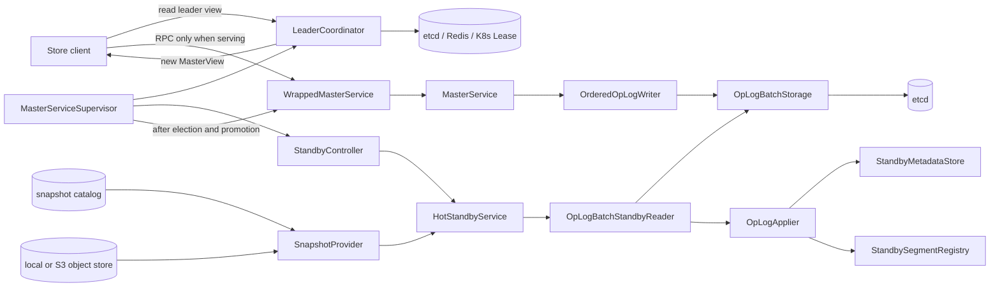
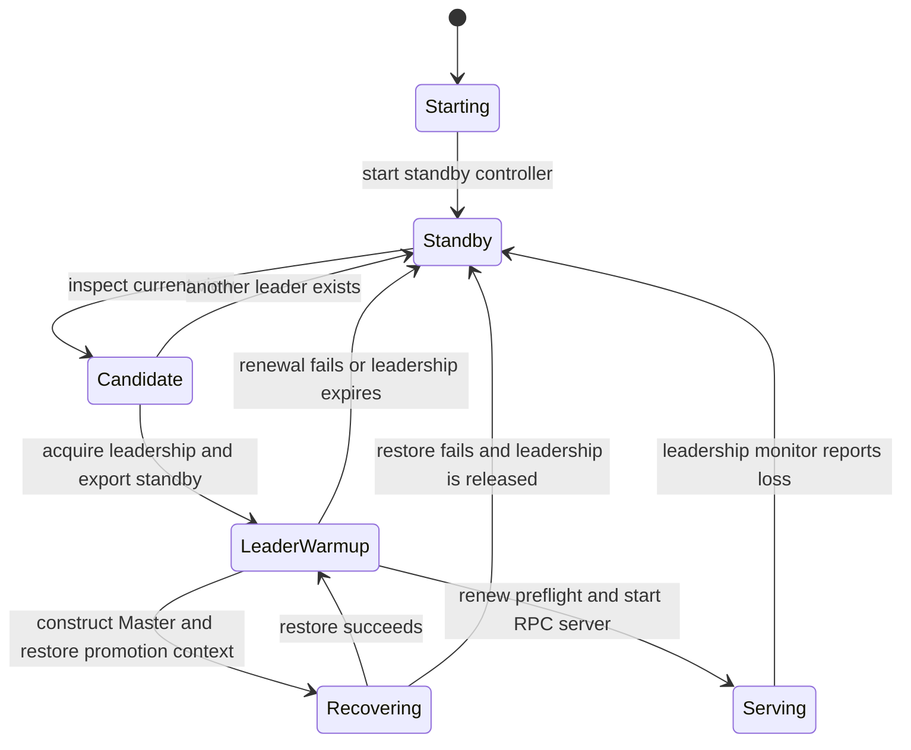
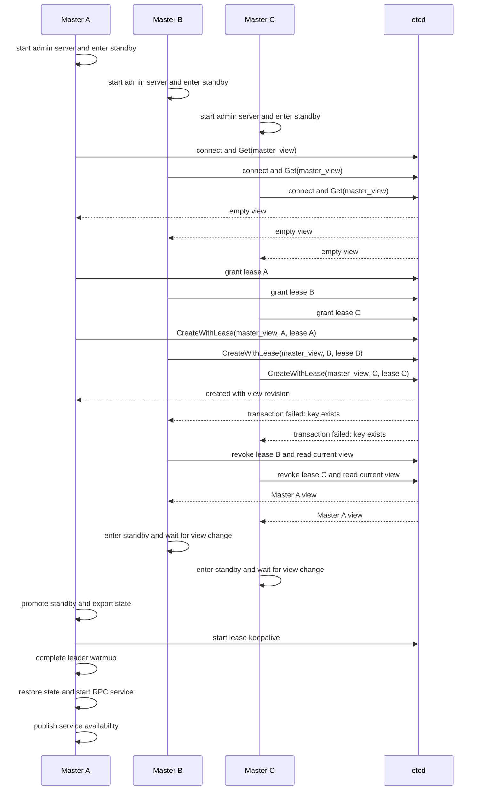
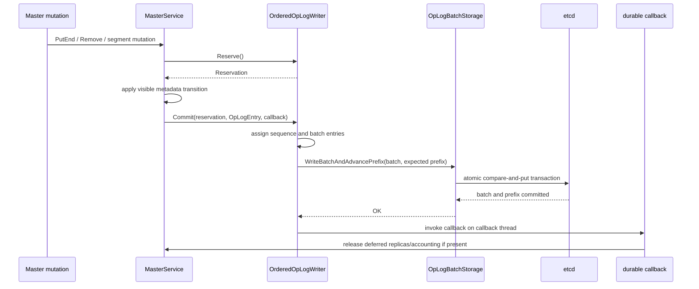

# Mooncake Store Master HA architecture

> Source snapshot: 2026-09-08
>
> Scope: Master leader election, serving supervision, etcd batch-record OpLog
> replication, standby promotion, and snapshot bootstrap. Object-byte
> replication and Mooncake PG failover are outside this document.

## Purpose

This document maps the current HA implementation from process startup through leader election, 
primary metadata mutation, standby replay, promotion, and client reconnection. 
Production findings, release coverage, and deployment acceptance criteria are maintained separately in [community-track.md](community-track.md).

The implementation has three independent capability layers:

| Layer | Purpose | Backends |
|---|---|---|
| Leadership | Elect one Master view and detect leadership loss | etcd, Redis, or Kubernetes Lease |
| OpLog replication | Replicate ordered Master metadata mutations to a standby | etcd only |
| Snapshot bootstrap | Load a metadata baseline before OpLog following or promotion | Configured snapshot catalog and object store |

`enable_ha` activates the supervised leadership lifecycle. `enable_oplog` requires `enable_ha=true` and `ha_backend_type=etcd`. 
Election-only HA is therefore possible with all three leadership backends, while continuous metadata following is currently an etcd capability.

## Component map



The standby maintains metadata required to construct a future primary. The
supervisor activates the normal Store RPC interface by constructing and
publishing a `WrappedMasterService` after leadership acquisition, standby
export, restore, and leadership preflight succeed.

## Runtime ownership

### `MasterServiceSupervisor`

The supervisor owns the outer process lifecycle. 
It creates the leadership coordinator and standby controller, updates the admin service, 
constructs the serving RPC server, and tears the server down when leadership is lost.

Primary source:
[`master_service_supervisor.cpp`](../../../mooncake-store/src/ha/leadership/master_service_supervisor.cpp).

### `LeaderCoordinator`

The interface abstracts backend-specific leadership operations:

```text
ReadCurrentView
TryAcquireLeadership
RenewLeadership
WaitForViewChange
StartLeadershipMonitor
ReleaseLeadership
```

A successful acquisition returns `LeadershipSession`, containing the published `MasterView`, an opaque backend owner token, and a lease TTL. 
The view contains the leader RPC address and monotonically meaningful `view_version` used by clients to reject an older view.

Primary source:
[`leader_coordinator.h`](../../../mooncake-store/include/ha/leadership/leader_coordinator.h).

### `StandbyController` and `HotStandbyService`

`StandbyController` converts configured capabilities into one of two implementations:

- `NoopStandbyController` for election-only HA;
- `CapabilityDrivenStandbyController` when either capability is enabled.

The capability-driven controller owns `HotStandbyService`, maps its internal state to the public Master runtime state, and exports `PromotionContext`.
`HotStandbyService` owns the standby metadata store, segment registry through the applier, OpLog reader, bootstrap provider, state machine, and replication thread.

Primary sources:

- [`standby_controller.cpp`](../../../mooncake-store/src/ha/standby_controller.cpp)
- [`hot_standby_service.cpp`](../../../mooncake-store/src/hot_standby_service.cpp)
- [`standby_state_machine.cpp`](../../../mooncake-store/src/standby_state_machine.cpp)

#### Standby activation path

`EnterStandbyMode` coordinates leader observation and standby data processing:

```text
EnterStandbyMode(observed_leader)
  -> enable standby runtime-state callbacks
  -> UpdateObservedLeader
       -> publish the view through MasterAdminServer
       -> cache the view in StandbyController
  -> StartStandby
       -> active standby: report its current runtime state
       -> idle standby: validate dependencies, then call HotStandbyService::Start
            -> prepare standby metadata and the configured snapshot baseline
            -> OpLog following: create the reader and start its replication loop
  -> publish the resulting standby runtime state
```

Snapshot restoration and OpLog following are capability-dependent operations.
With etcd OpLog following, the replication loop reads the shared OpLog through `oplog_connstring` and `cluster_id`. 
An empty observed-leader view therefore supports the initial standby activation. 
Later view updates refresh control-plane state while the active replication loop continues processing the shared OpLog.

## Supervisor lifecycle

The serving lifecycle gates RPC publication on election, standby promotion,
state restoration, leadership preflight, and RPC startup.



### Concurrent initialization with an empty etcd cluster

When multiple Masters start with the same etcd endpoints and cluster namespace, each coordinator derives the same `mooncake-store/<cluster namespace>/master_view` key. 
Etcd stores this shared key, so every newly constructed coordinator can observe the current view.

The following sequence uses Master A as an example winner. 
Etcd transaction ordering selects the winner at runtime.



The essential supervisor decision chain is:

```text
MasterServiceSupervisor::RunSupervisorLoop
  -> ReadCurrentView / etcd Get(master_view)
       -> error: enter standby and handle or retry the backend error
       -> leader exists: UpdateObservedLeader, enter standby, wait for change
       -> empty view: TryAcquireLeadership / etcd CreateWithLease
            -> error: enter standby and handle or retry the backend error
            -> ACQUIRED + session: promote, warm up, restore, and serve
            -> CONTENDED: update observed winner, enter standby, wait for change
```

On the `CONTENDED` branch, `acquire.observed_view` identifies the candidate that won the race. 
Leadership ownership requires both `status == ACQUIRED` and a `LeadershipSession`.

`ReadCurrentView` returns `tl::expected<std::optional<MasterView>, ErrorCode>`. 
A missing key produces a successful read containing an empty `optional`, which directs each Master to attempt acquisition. 
`CreateWithLease` performs conditional creation in etcd, so one competing candidate creates the key. 
The remaining candidates revoke their unused leases, reread the winning view, and return to standby.

The winning key is attached to the winner's lease. 
The winner completes standby promotion, maintains the lease through the warmup interval, restores its promotion context, 
passes the final leadership preflight, and starts the RPC server. 
The supervisor then publishes service availability. 
An etcd `MasterView` therefore represents lease ownership, while published service availability represents RPC readiness. 
Lease expiration removes the etcd key and begins another election.

The concrete promotion call chain is:

```text
MasterServiceSupervisor::RunSupervisorLoop
  -> LeaderCoordinator::ReadCurrentView / WaitForViewChange
  -> LeaderCoordinator::TryAcquireLeadership
  -> StandbyController::PromoteStandbyAndExport
       -> HotStandbyService::PromoteAndExportSnapshot
            -> StopReplicationLoop
            -> FinalCatchUpForPromotionLocked
            -> export applied sequence, objects, and segments
  -> WarmupLeadership for one acquired lease TTL
  -> construct WrappedMasterService with the acquired view version
  -> WrappedMasterService::RestoreFromStandby
       -> MasterService::RestoreFromStandbySnapshot
  -> LeaderCoordinator::RenewLeadership preflight
  -> register and start RPC service
  -> publish service availability and leader label
  -> StartLeadershipMonitor
```

Restore is a serving gate. 
Invalid tenants, duplicate objects, unknown segment references, invalid descriptor sizes, over-capacity descriptors, or overlapping memory ranges produce a restore error. 
The supervisor publishes the candidate service after a successful restore; 
an error releases leadership and returns the process to standby operation.

While serving, the leadership monitor callback first marks the service unavailable, 
clears the Kubernetes leader label when applicable, changes the runtime state, and stops the RPC server. 
The supervisor then destroys the serving service, releases the leadership session, reads the current view, and restarts standby operation.

## Primary metadata replication

### Mutation to durable batch

The serving `MasterService` uses `OrderedOpLogWriter` when OpLog is enabled.
The main path is:



`Reserve()` provides bounded admission before a mutation that cannot safely be left unlogged. 
A reservation is move-only and aborts automatically if it leaves scope without a commit. 
`Commit()` assigns the next sequence ID and queues the entry. 
The writer seals queued entries into a batch of at most the configured limit and has one batch write in progress at a time.

`OpLogBatchStorage` atomically writes:

```text
/oplog/<cluster>/batches/<20-digit batch id> = OpLogBatchRecord
/oplog/<cluster>/durable_prefix            = {batch_id, last_seq}
```

The transaction compares the stored durable prefix with the writer's expected prefix. 
A committed batch must advance both batch ID and entry sequence range contiguously. 
Standbys consume only records covered by the durable prefix, so an isolated batch object that did not advance the prefix is not visible to replay.

Each `OpLogEntry` contains:

```text
sequence_id, timestamp_ms, op_type, tenant_id,
object_key, payload, checksum, prefix_hash
```

Current apply support covers `PUT_END`, `PUT_REVOKE`, `REMOVE`,
`SEGMENT_MOUNT`, `SEGMENT_UNMOUNT`, and `SEGMENT_UPDATE`. `LEASE_RENEW` exists
in the enum but is not handled by `OpLogApplier`.

### Visibility and durability classes

The Master uses two integration patterns:

| Pattern | Master behavior | Typical use |
|---|---|---|
| Visible before durable | Mutate live metadata, enqueue the OpLog entry, return without a durable callback | `PUT_END` and several segment-state updates |
| Durable finalization | Reserve first, mark a logical transition, enqueue with a callback, release physical resources after the batch is durable | Remove, eviction, replica retirement, and cleanup paths |

`AppendOpLogVisibleBeforeDurable` returning success means the entry was accepted into the writer, not that the durable prefix has advanced. 
Durable callbacks run on a separate callback thread after the batch transaction succeeds.

The writer retries transient backend failures with exponential backoff. 
A retry timeout, a failed prefix transaction interpreted as fencing, or a non-retryable write error enters terminal state and closes new admission.

### Producer-view fencing boundary

`OpLogBatchStorage` implements `ClaimProducerView`, producer-view validation, and an overload that compares the producer view in the batch transaction.
In the source snapshot documented here, `MasterService::InitializeBatchOpLogWriter` binds the two-argument `WriteBatchAndAdvancePrefix(batch, expected_prefix)` overload. 
No production call to `ClaimProducerView` is present. 
The durable prefix compare prevents two writers from advancing the same prefix concurrently, but the storage-level producer-view fencing API is not wired into this construction path.

This is an observed implementation boundary, not a proposed behavior. 
The release and upstream status implications are tracked in [community-track.md](community-track.md).

## Standby replay

### Bootstrap

`HotStandbyService::Start` creates a fresh `OpLogApplier` for the configured cluster and prepares a baseline:

```text
recoverable in-process metadata exists
  -> reuse it and recover the applier cursor

otherwise snapshot bootstrap enabled
  -> load latest catalog snapshot
  -> restore tenant-aware object metadata and segment registry
  -> set expected sequence to snapshot sequence + 1

no snapshot or snapshot load fails while OpLog following is enabled
  -> fall back to OpLog-only bootstrap from sequence 1
```

Snapshot-only mode stops after baseline activation. 
OpLog mode constructs an etcd backend and `OpLogBatchStandbyReader`, then starts the replication loop.

### Poll and apply

```text
HotStandbyService::ReplicationLoop
  -> OpLogBatchStandbyReader::PollOnce
       -> ReadDurablePrefix
       -> ReadBatch(prefix.batch_id) and validate terminal sequence
       -> ReadBatchesAfter(last_applied_batch_id)
       -> validate contiguous batch and sequence order
       -> OpLogApplier::ApplyOpLogEntry for each durable entry
            -> validate size and checksum
            -> reject a future sequence; skip an older duplicate
            -> mutate StandbyMetadataStore or StandbySegmentRegistry
  -> update applied sequence, primary sequence, lag, and runtime status
```

The reader treats missing batches, regressing prefixes, discontinuous batch IDs, discontinuous entry sequences, checksum failures, 
and apply failures as incomplete catch-up. 
Backend transport errors can be retried until the configured retry timeout; 
structural history errors are fatal. 
A fatal poll transitions the standby state machine to `FAILED` and stops replication.

`StandbyMetadataStore` is a mutex-protected two-level map:

```text
tenant_id -> user_key -> StandbyObjectMetadata
```

`StandbyObjectMetadata` contains the client ID, object size, replica descriptors, group ID, data type, optional hard pin, and optional checksum.
Lease deadlines, task tables, and tenant quota ledgers are not independently replicated. 
The new primary rebuilds derived group state and tenant quota usage while restoring object metadata.

## Promotion and final catch-up

Promotion requires the internal standby state to be `WATCHING`. 
A large reported lag produces a warning but does not block promotion because the promotion path performs a final durable-prefix catch-up.

`PromoteLockedInternal` performs these steps while serializing promotion:

1. Notifies snapshot lifecycle hooks and stops the background replication
   loop.
2. Polls the batch-record durable prefix until local apply reaches it.
3. Retries transient failures with bounded backoff for up to 30 seconds.
4. Fails with `INCOMPLETE_OPLOG_CATCH_UP` if the prefix cannot be reached or a
   structural gap remains.
5. Records the final applied sequence and transitions to `PROMOTED`.
6. Exports the object map and segment registry before releasing the promotion
   mutex.

The resulting `PromotionContext` is an in-process handoff:

```text
PromotionContext
├── applied_seq_id
├── vector<StandbyObjectEntry> objects
└── vector<StandbySegmentInfo> segments
```

The supervisor constructs a new `MasterService`, restores that context, and initializes its OpLog writer from the backend durable prefix. 
The serving primary does not restore directly from a snapshot; 
its configuration disables `enable_snapshot_restore` for this phase so the promotion context remains the single restore source.

## Snapshot architecture and current wiring

The active controller can construct `CatalogBackedSnapshotProvider` when `enable_snapshot_restore` is enabled. 
The provider resolves the latest descriptor through the configured catalog, 
downloads the manifest, segment payload, and metadata payload from the object store, validates and decodes them, and returns a standby baseline.

The repository also contains a newer batch-OpLog snapshot subsystem:

```text
BatchOpLogSnapshotCoordinator
  -> acquire snapshot maintenance lease
  -> request a capture at an applied durable prefix
  -> stream object chunks from StandbyMetadataStore
  -> write immutable snapshot artifacts
  -> publish latest/fallback metadata
```

Capture freezes standby mutation traversal until the capture lease is released, which keeps the object chunks consistent with the recorded durable prefix. 
The coordinator can cancel capture on stop or promotion.

In the production construction path in this source snapshot,
`StandbyController` installs `CatalogBackedSnapshotProvider`; it does not
construct `BatchOpLogSnapshotCoordinator` or install
`BatchOpLogSnapshotProvider`. Those batch-snapshot classes and lifecycle seams
are therefore available components but are inert unless another caller wires
them explicitly.

The serving primary also skips its legacy periodic snapshot manager when both
snapshot and batch-record OpLog are enabled, because that mode assigns
snapshot ownership to the standby architecture.

## Client leader tracking

A Store client given an HA backend URI creates the same type of `LeaderCoordinator`, reads the current `MasterView`, and connects to its leader address. 
A background thread waits for view changes. 
`SwitchLeader` ignores a view older than the client's current version and reconnects when the address or version advances, 
or when the existing connection failed its health check.

```text
Client::ConnectToMaster(ha-backend URI)
  -> CreateLeaderCoordinator
  -> ReadCurrentView
  -> SwitchLeader
  -> LeaderMonitorThreadMain
       -> WaitForViewChange
       -> SwitchLeader(newer view)
       -> remount/re-register client state as required
```

Leader election, service readiness, and client reconnection are separate latency intervals. 
The Master is operational only after the supervisor marks the restored RPC service available and clients have observed and connected to the new view.

Primary source:
[`client_service.cpp`](../../../mooncake-store/src/client_service.cpp#L636).

## Concurrency boundaries

| Component | Synchronization | Protected state |
|---|---|---|
| Supervisor | Single control loop plus atomic callback gates | Accepted standby state updates and serving lifecycle |
| Leadership backend | Lease/session and backend transaction semantics | Current view and owner token |
| `OrderedOpLogWriter` | Internal mutex, condition variable, writer thread, callback thread | Reservations, sequence assignment, batch order, durable prefix, callbacks |
| `HotStandbyService` | Service mutex, atomics, replication thread, condition variable | Bootstrap, replay, promotion, sequence and status state |
| `StandbyMetadataStore` | One mutex | Tenant/object metadata map and snapshot traversal |
| `StandbyStateMachine` | Atomic current state plus mutex-protected history/callback list | Valid lifecycle transitions |

The writer never runs durable callbacks while holding its internal mutex. 
The standby snapshot capture coordinates with the replication loop so the capture cursor and durable prefix describe one consistent applied boundary. 
Promotion stops the replay loop before exporting state.

## Operational invariants

- Only a successfully acquired and renewed leadership session may reach the
  serving phase.
- Standby replay applies only the contiguous history covered by the durable
  prefix.
- OpLog entry ordering is global across tenants and object keys.
- Duplicate older entries are idempotently skipped; future entries are
  rejected as gaps.
- Promotion exports metadata only after final catch-up succeeds.
- Restore must complete before RPC availability is published.
- Leadership loss removes service availability before stopping the RPC server.
- The standby replicates metadata and allocation descriptors, not object
  bytes; the underlying storage segments remain the data plane.
- Election-only HA does not imply metadata recovery.
- A zero lag value is meaningful only together with a valid applied cursor and
  a complete bootstrap baseline.

## Source map

- Supervisor and serving gate:
  [`master_service_supervisor.cpp`](../../../mooncake-store/src/ha/leadership/master_service_supervisor.cpp)
- Leadership abstraction and backends:
  [`leader_coordinator.h`](../../../mooncake-store/include/ha/leadership/leader_coordinator.h)
- Standby construction:
  [`standby_controller.cpp`](../../../mooncake-store/src/ha/standby_controller.cpp)
- Standby bootstrap, replay, and promotion:
  [`hot_standby_service.cpp`](../../../mooncake-store/src/hot_standby_service.cpp)
- Ordered primary writer:
  [`ordered_oplog_writer.cpp`](../../../mooncake-store/src/ha/oplog/ordered_oplog_writer.cpp)
- Batch storage transaction:
  [`oplog_batch_storage.cpp`](../../../mooncake-store/src/ha/oplog/oplog_batch_storage.cpp)
- Standby batch reader:
  [`oplog_batch_standby_reader.cpp`](../../../mooncake-store/src/ha/oplog/oplog_batch_standby_reader.cpp)
- Entry application:
  [`oplog_applier.cpp`](../../../mooncake-store/src/ha/oplog/oplog_applier.cpp)
- Standby metadata representation:
  [`metadata_store.h`](../../../mooncake-store/include/metadata_store.h)
- Primary restoration:
  [`MasterService::RestoreFromStandbySnapshot`](../../../mooncake-store/src/master_service.cpp#L3107)
- Snapshot bootstrap:
  [`catalog_backed_snapshot_provider.cpp`](../../../mooncake-store/src/ha/snapshot/catalog_backed_snapshot_provider.cpp)
- Batch-OpLog snapshot components:
  [`batch_oplog_snapshot_coordinator.cpp`](../../../mooncake-store/src/ha/snapshot/batch_oplog/batch_oplog_snapshot_coordinator.cpp)
